> 这是关于网络系列的第三篇文章,接下来会有更多精彩内容.敬请期待! 让我们一起乘风破浪!

[上篇]({{ site.url }}/2017/12/29/udp/)我们了解了关于 UDP 协议的相关知识,这里我们继续讨论运输层的 TCP 协议.该篇篇幅较长,希望你能耐心的读下去并有所收获.

# TCP 概述

TCP 本身比较复杂, 也比较重要, 这里先简单了解下.慢慢来!

## TCP 的主要特点

- 面向连接.应用程序在使用 TCP 之前, 必须建立 TCP 连接. 在传送完数据之后,再释放连接.
- 点对点通信.连接了两端的 socket.
- 提供可靠交付的服务. 通过 TCP 连接传送的数据, 无差错, 不丢失, 不重复且按序到达.
- 全双工.双方可以在任何时候发送数据.
- 面向字节流. <br/>流是指流入到进程或从进程流出的字节序列.<br/>面向字节流的含义是:虽然应用程序和 TCP 交互的是大小不等的数据块,但 TCP 把这些数据看成`无结构的字节流`.TCP 只保证发送方发出的字节流和接收方接到的字节流相同.

## TCP 的连接

每条 TCP 连接有两个端点(正是 TCP 提供点对点通讯的体现).其连接的两个端点称为`套接字(socket)`.套接字是由 IP 地址和端口组成, 中间使用冒号隔开.如`192.168.0.1:80`.

## TCP 可靠传输的工作原理

TCP 报文最终还是要交付到网际层的 IP 协议手中,而 IP 协议不提供可靠的服务,TCP 必须自己才去措施保证服务的可靠.下面先了解下相关的理论基础.

### 停止等待协议

`停止等待协议`意为每发送完一个分组就停止发送,等待对方的确认,在收到对方确认后再发送下一个分组(TCP 提供全双工的通信,为了简单这里只考虑 A 做为发送方,B 作为接收方).

#### 无差错情况

使用下图来理解下:

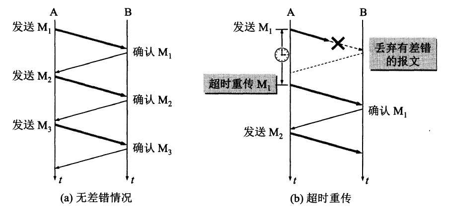

在没有差错情况下(如上图 a 情况),A 发送分组 M1,发完就暂停,等待 B 的确认.B 收到了 M1 就向 A 发送确认. A 收到对 M1 的确认后发送 M2..M3.这是`停止等待协议 `在无差错时的表现.

#### 出现差错

上图 b 是传输过程中出现差错的情况.B 接受到 M1 检测出了差错,丢弃了 M1,其他什么也不做了(也可能 M1 根本没有到达 B).A 在指定时间内没有收到对 M1 的确认,就认为 M1 丢失,需要重传,这就叫做`超时重传`.要实现超时重传就要在发送完分组后设置一个超时计时器,若在计时器到期之前收到了确认报文,就撤销计时器.这里需要注意以下内容:

- A 在发送完分组之后,需要暂时保留发送出去的分组,以便实现超时重传.在收到确认后才能清除该分组.
- 分组和确认分组都需要进行编号 ,以便区分.
- 超时计时器的时间应当比`分组传输的往返时间更长一些.`关于时间如何选择,后面会进一步了解.

#### 确认丢失和确认迟到

确认丢失和确认迟到也是可能出现的情况.如下:

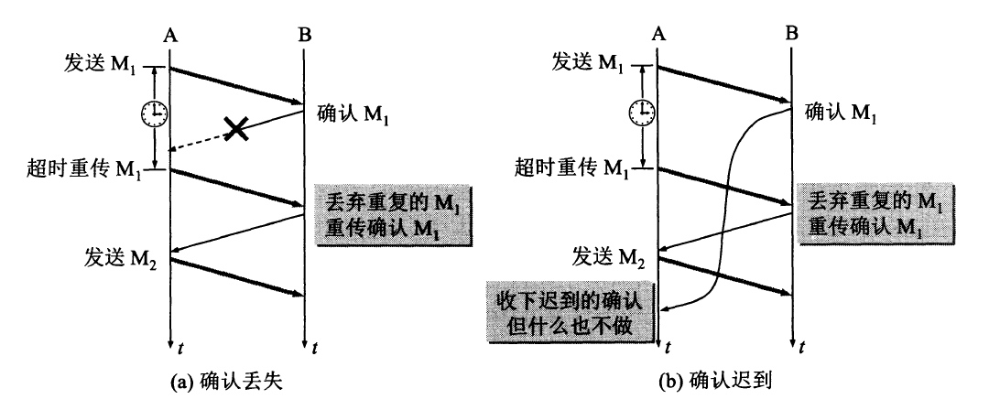

- 确认丢失<br/>如上图 a. B 发送出的对 M1 的确认丢失了.A 在规定时间内没有接收到确认,无法知道是自己发出的分组出错,丢失,或 B 的确认丢失.A 需要在计时器到期后重传 M1.这时 B 又收到了 M1,需要

  - 丢弃该分组 M1,不向上层交付.
  - 向 A 发送确认.以免 A 再次发送 M1.

- 确认迟到<br/>如上图 b. 由于网络延迟等原因,B 发出的对 M1 的确认没能在指定时间内到达 A,而是在以后的某个时间到达了.这时 A 会收到重复 的确认(因为 A 会超时重传).对于这样的确认,A 只需丢弃.对于重传的 M1,B 也需要确认,并丢弃 M1.

上述的确认和重传机制,就是 TCP 实现可靠传输的依据.

#### 信道利用率

停止等待协议简单,但是信道的利用率太低,如下图:

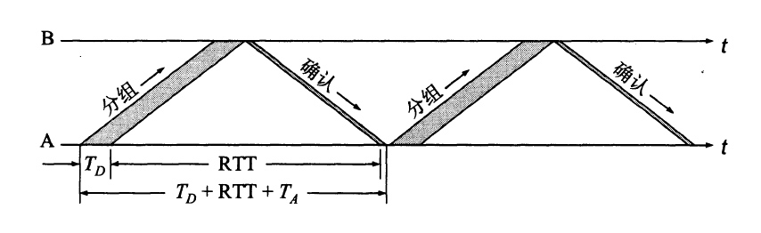

- Td 是发送分组所需时间, 等于分组长度除以发送速度.
- RTT 是`发送的分组到达对方使用的时间` 和 `对方确认分组回来使用的时间`之和.
- Ta 是发送确认分组使用的时间, 等于确认分组的长度除以发送速度.

因为仅在 Td 的时间内是用来传送有用数据的,信道利用率可以使用下面的算法来粗略估计:
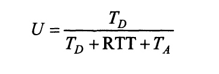

现假定 1200km 的信道往返时间 RTT=20ms.分组长度 1200bit,发送速率 1 Mbit/s.忽略其他处理时间和 Ta(一般 Ta 远小于 Td).可算出 U = 5.66%. 信道的利用率超低!随着发送速率的增加,这个数字还会下降!

### 连续 ARQ 协议

为了提高信道了利用率, 可以采用流水线的方式传输, 这句涉及得到`连续ARQ协议`.
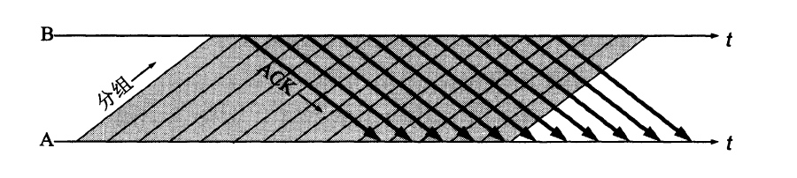

在`连续ARQ协议`中,发送方需要维持一个 `发送窗口`,它可以使在窗口内的连续多个分组的数据连续发送出去,不必等待对方的确认.如下图:
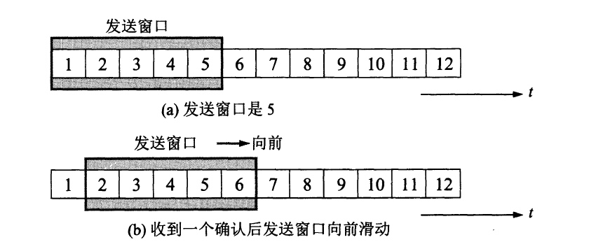

图中的`发送窗口大小为5`, a 中的 5 个分组可以连续的发送不用等待确认.在发送方每收到一个确认,就将发送窗口向前(向前指向着时间增大的方向,向后指向时间减少的方向)滑动一个位置.如 b 所示.此时可以发送第 6 个分组了.

接收方一般采取累积确认的方式, 接收方不必对每个分组逐个发送确认,而是在收到几个分组后,`对按序到达的最后一个分组发送确认, 这就表示到这个分组为止的所有分组都以正确收到`.这样的优点是即使确认丢失也不必重传,缺点是不能向发送方反映出接收方已经正确收到的所有分组信息.

例如,发送方发送了 5 个分组,而中间 3 个分组丢失.这时接收方只能对前两个分组确认.发送方无法知道后 3 个分组的下落,只好把后 3 个都重传一次.这就叫做`Go-back-N`,表示需要在退回来传送以发送的 N 个分组.

滑动窗口是 TCP 的精华所在,后面再详细的说明.

## TCP 报文首部

在深入了解 TCP 之前, 了解 TCP 报文首部是必要的.下面一起来了解下其首部的具体内容.

虽然 TCP 是面向字节流的, 但 TCP 传送的数据单元是报文. 一个 TCP 报文包括首部和数据两个部分(IP 报文和 UDP 报文也是由首部和数据组成),TCP 的功能也是依靠首部各个字段的.
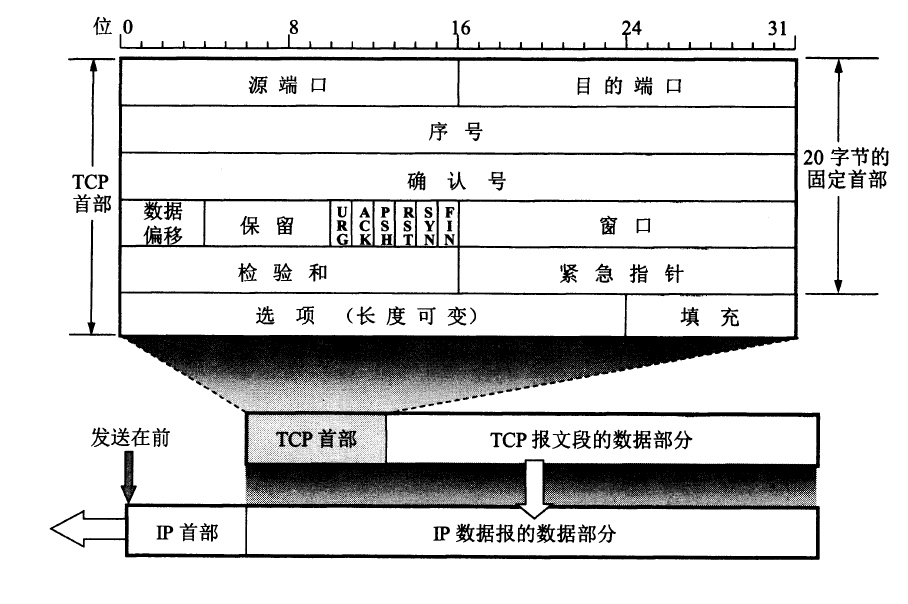

从上图可以看到, TCP 的首部是由固定的 20 字节加上后面的选项部分(4n 字节,n 需要为整数).

- 目的端口和源端口, 各占 2 字节.基于端口复用和分用.
- 序号, 占 4 字节. 范围是[0, 2^32 - 1].序号达到最大值后, 又回到 0 从新开始.因为 TCP 是面向字节流的, 在 TCP 中传送的每一个字节都按序编号. 整个要传送的字节流的起始序号在连接建立时确定.首部中的该字段指的是`本报文段所发送的数据的第一个字节的序号`.例如: 一个报文段的序号为 301, 而携带数据 100 字节; 可以确定的是,本报文段数据的第一个字节序号为 301, 最后一个字节的序号为 400, 下一个报文段的序号应该是 401.
- 确认号, 占 4 字节.表示`期望收到对方下一个报文段的数据第一个字节的序号`.例如,B 正确收到 A 发过来的一个报文段,其序号值为 501,而数据长度是 200 字节(也就是说该报文段的数据字节序号从 501 到 700).这表明 B 正确收到了 A 发送的到序号 700 为止的数据, 因此 B 期望收到 A 的下一个数据的序号是 701, 于是 B 将发给 A 的确认报文的确认号置为 701.请记住,确认号为`N`,表明序号为`N-1`的所有数据都以正确收到.
- 数据偏移, 占 4bit. 它指出 TCP 报文段的数据起始处距离 TCP 报文段的起始处有多远(单位 4 字节).其实它指出了 TCP 报文首部的长度是多少.由于 TCP 报文首部还有不确定的选项部分,该字段的存在是必要的.最大偏移为`15 * 4字节=60字节(也确定了TCP首部的最大字节数)`, 去掉首部固定的 20 字节, 即选项部分最大为 40 字节.
- 保留, 占 6bit. 暂未使用,目前置为 0.
- 紧急 URG(URGent), 占 1bit. 当`URG=1`时,表明后面的紧急指针有效.它表明该报文中有紧急数据,需要优先传送.
- 确认 ACK(ACKnowledgment), 占 1bit.当`ACK=1`时,`确认号`字段才有效.
- 推送 PSH(Push),占 1bit. 当两个应用程序进行交互式通信时, 在一端的应用进程希望在键入一个命令后立即的到对方的响应.这种情况下,TCP 可以将 PSH 置为 1,并立即创建一个报文发送出去,接收方在收到`PUS=1`的报文后,尽快的向上交付.
- 复位 RST(ReSet), 占 1bit. 当`RST=1`时,表明 TCP 连接出现严重错误,必须释放连接,重新建立.还可以使用`RST=1`来拒绝一个非法的报文段或拒绝打开一个连接.
- 同步 SYN(SYNChronization), 占 1bit. 在建立连接时使用同步序号.当`SYN=1`而`ACK=0`时表明这是一个请求建立连接的报文. 若对方同意建立连接,则响应报文中 SYN 和 ACK 都应该是 1.可以发现,当`SYN=1`时说明该报文是用来建立连接的(请求建立连接报文,或同意建立连接报文).
- 终止 FIN, 占 1bit.用来释放连接,当`FIN=1`时,表明此报文的发送方数据已经发送完毕,要求释放连接.
- 窗口, 占 2 字节.值的范围是[0, 2^16 - 1]之间的整数.指出了`接收方目前可以接受数据的大小, 发送方在发送数据时必须考虑到这点`.例如,A(作为接收方)发出了一个确认报文,确认号为 701(这表明前 700 个编号数据都正确接收),窗口字段为 1000. 这表明`A的接收缓存空间还可以接收从编号701到1700的1000字节数据`.总之,窗口明确指出了`允许发送方发送的数据数量`.
- 校验和, 占 2 字节. 包含首部和数据两部分的校验.这里不对校验的方法做深入讨论.
- 紧急指针, 占 2 字节.仅在`URG=1`才有效.它指出紧急数据的字节数量(紧急数据在该报文的数据部分最前方).即使窗口为 0,也可以发送紧急数据.
- 选项, 长度可变,最长 40 字节.

# TCP 可靠传输的实现

为了方便说明,下面的讨论基于 A 发送数据,B 接收给出确认.

## 以字节为单位的滑动窗口

假定 A 收到了 B 的确认报文,该报文首部的`窗口`字段值为 20 字节,`确认号`字段为 31(这表明 B 正确接收了前 30 字节的数据, 期望收到编号为 31 开始的数据).那么 A 可以根据此信息构造自己的`发送窗口`.如下:
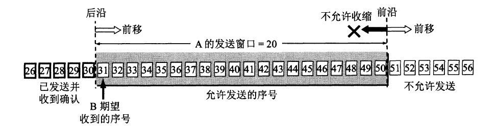

说明如下:

- A 此时可以将窗口内的数据都连续的发送出去, 在未收到确认之前,该数据需要保留,以便超时重传使用.
- A 的发送窗口的大小受 B 确认报文中的`窗口`字段值的影响(现在 A 的发送窗口大小为 20).A 的发送窗口大小不能超过 B 指定的窗口大小.
- A 的发送窗口后沿后面部分的数据是以收到确认的,可以不再保留.前沿前面的数据是不能发送的,对方 B 没有足够的缓存区接收.
- A 的发送窗口的后沿变化情况有两种:
  - 不动.说明没有收到新的确认.
  - 向前移动.说明收到了新的确认.
  - 不可能出现向后移动,若向后移动代表确认过的报文需要再次确认,这是不存在的.
- A 的发送窗口的前沿通常不断向前移动,但可能不动:

  - 未收到新的确认,B 通知的窗口大小也未变化.
  - 收到新的确认,但 B 的窗口缩小,刚好使 A 的发送窗口不动.

  若 A 收到确认后,得知 B 的接收窗口小于现在的发送窗口, 这时需要 A 发送窗口的前沿向后移动! 这是 TCP 标准强烈不建议的.因为 A 可能再收到该确认之前,已经将发送窗口的数据发送出去,现在又不允许发送(数据不在窗口中就是不允许发送的意思).将会出错.

假定现在 A 发送了`31~41`的数据,但未收到确认,发送窗口位置不变,`42~50`表示未发送的.如下图 a 示 :
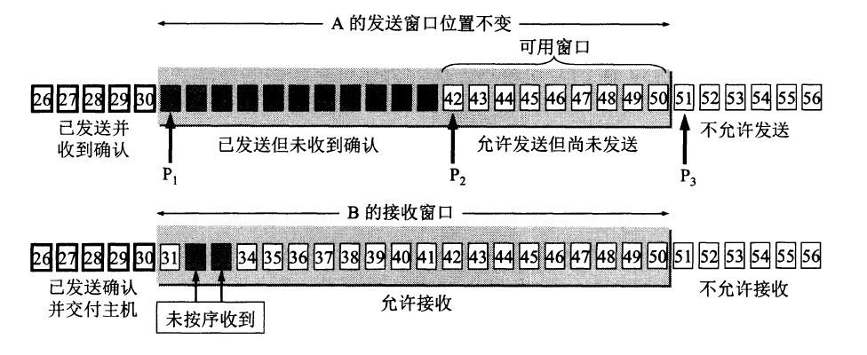

从上面的情况可以看出,描述一个发送窗口的状态需要如上图的三个指针:`P1`,`P2`,`P3`,它们都指向字节的序号.

- 小于 P1 的表示已发送且收到确认的部分,大于等于 P3 的表示不允许发送的.
- `P3-P1`表示了 A 的发送窗口
- `P2-P1`表示发送但未确认的字节数
- `P3-P2`表示允许发送但未发送的字节,或者称为可用窗口或有效窗口.

对于上图 B 的接收窗口:

- B 的接收窗口大小为 20(从 31~50).30 及之前的数据时已经发送确认且交付上层的,可用不用保留了.序号 31~50 的数据是允许接收或希望接收的数据.
- 假设现在 B 收到了序号 32 和 33 的数据,但未接收到序号 31 的数据,B 只能给出确认号为 31 的确认,不能是 32 或 33.

现在假定 B 接收到了 31 号数据 ,并将序号 31~33 的数据交付上层,然后删除这些数据,给 A 发出确认报文(确认号为 34).将窗口向前移动 3 个序号 ,窗口大小任然为 20.

现在 B 又收到了未按序到达的 37,38 和 40 的数据,B 选择先暂存.

A 在收到 B 的确认后,将发送窗口向前移动 3 个序号,P2 指针不动(P2 表示了 A 可以发送但未发送的起始序号),现在 A 可以发送的数据增多了,直到 53.

上面的情况如下:
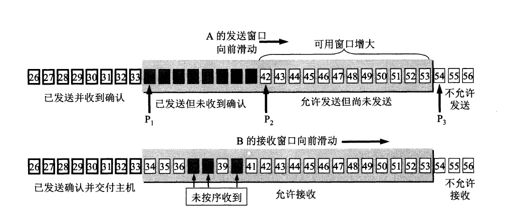

现在 A 选择继续发送数据,将 A 中的待发送数据全都发送出去.如下:
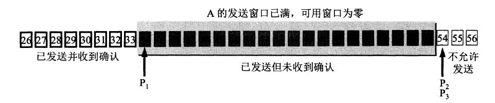

此时,A 并没有收到 B 确认,自己的有效窗口为 0,不再继续发送数据. 也许在超时计时器到期后 A 任然未收到 B 的确认,A 会重新发送数据,直到收到 B 的确认后.

通过上面的描述,我们了解了 TCP 中滑动窗口的工作模式,希望你能理解.

## 超时重传时间的选择

超时重传是保证 TCP 可靠的重要举措, 这个时间时如何确定的呢?

TCP 采用了自适应的算法: 它会记录一个报文发出去的时间,和接收到相应确认的时间.这两个时间之差就是报文段的往返时间 RTT.TCP 还会保留 RTT 的加权平均 RTTs.当第一次获取到 RTT 时,RTTs 的值也是这个,以后每次获取到 RTT 后,就会重新计算 RTTs:

```
新的RTTs = (1-x) *  旧RTTs + x * 新RTT值
```

超时重传时间(RTO, retransmissionTime-Out)应略大于 RTTs,具体更详细的计算,这里就不再展开.

## 选择确认 SACK

若接收方收到的报文无差错,只是未按序到达,中间缺少了一些, 那么能否只让发送方只重传缺少的数据呢? 选择确认是一种方法.

假如,接收方收到的数据如下:
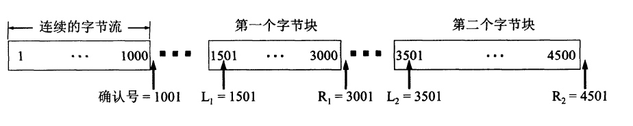

- 1~1000, 1501~3000, 3501~4500 已经正确收到
- 中间多个部分缺失

若想发送方只传递缺失部分,需要告知接收方接收数据的情况.接收方可以将这些边界告知发送方.例如图中的 L1, R1, L2, R2...

若选择使用`选择确认`,需要在 TCP 连接建立时彼此商量好,在 TCP 报文首部的`选项`部分来说明这些边界值.

L1, R1, L2, R2 这些也是报文序号中的一个,因此每一个需要 4 字节.在接收方存在多个不连续数据时,报文首部的选项字段的大小(40 字节)是不够用的.所以重传时大多还是选择对未确认的数据重传.

# 基于滑动窗口的流量控制

流量控制,控制的流量是发送方发出的流量,不至于发的数据太多,接收方来不及接收.TCP 基于滑动窗口很容易实现流量控制.借用下图理解下:
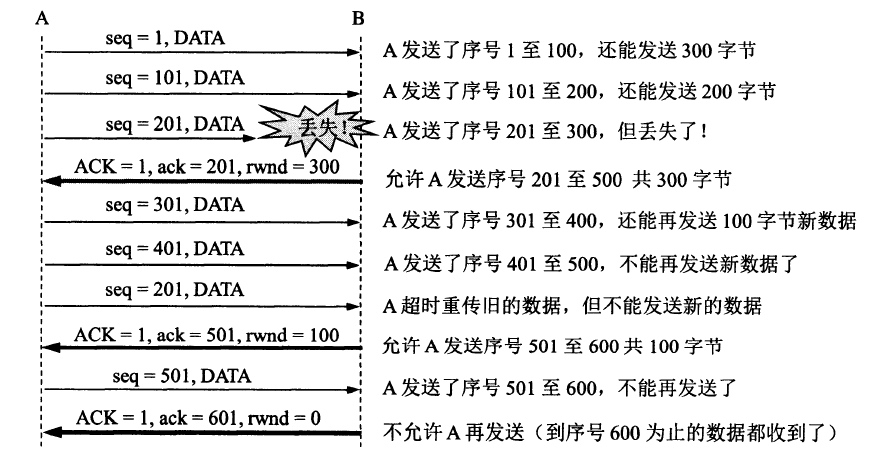

- 在建立连接时,接收方(B),告诉了发送方(A):`我的接收窗口是400(单位字节)`.
- 图中的`ACK`为 TCP 首部的 ACK 字段,`ack`为首部的确认号字段.
- 流量控制体现在:`rwnd=300, rwnd=100, rwnd=0`.在确认报文的窗口字段设定了发送方能够发出的数据多少,从而控制流量.注意只有到首部的`ACK`字段值为 1,窗口字段的值才有效.
- 假设在 B 发送了`rwnd=0`之后,过段时间由于自己又希望接收到数据,于是发出`rwnd=400`的报文,但是该报文丢失了,这样 A 依然无法发送数据,B 希望接收但接收不到数据.

  为解决该问题,TCP 为每个链接都设有一个`持续计时器`.只要接收到对方窗口为 0 的通知,就启动持续计时器.在计时器到期后,就发送`探测报文`,对方可以在该报文的确认中告知当前的窗口值.若窗口任然为 0,那么就重新设定计时器,若不为 0,那么上述的问题就解决了.

是不是在理解了滑动窗口的基础上,流量控制应该很简单了吧!

# 拥塞控制

拥塞是指对网络某一资源(带宽,缓存等)的需求超过了可提供的部分,从而使网络中传送的数据不能按时到达,网络性能变差的情况.

拥塞控制就是防止过多的数据注入到网络中,这样网络中的资源压力就小了.

流量控制和拥塞控制似乎很相似,但是他们不同.前者立足于接收和发送者双方的情况;而后者注重的是数据量对网络环境的影响.

## TCP 控制拥塞的方法

TCP 采用`慢开始,拥塞避免,快重传,快恢复`.

- 慢开始.当连接建立开始传递数据时,由于不清楚网络状况,先将较小数据发送出去,有小到大的增加发送窗口.比如先发送一个字节数据,等收到确认后再发送 2 个字节...4 个等.每经过一次确认就将发送窗口加倍.
- 拥塞避免思路是在经过确认后,每次将发送窗口增加 1,而不是像慢开始那样成倍增加.

通过下图理解:
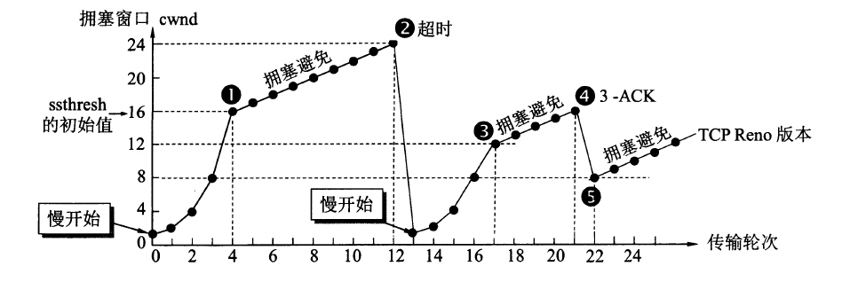

- 图中的 ssthresh 为`慢开始门限`,在慢开始的作用下,发送窗口成倍增加,不可能没有上限,这个上限就是`慢开始门限`.`慢开始门限`以下使用慢开始控制发送窗口,而在`慢开始门限`以上使用避免拥塞方法.
- 横轴,传送轮次意为:连续发出的数据,再经过确认后,称为一个轮次. 纵轴,拥塞窗口,就是发送窗口.
- 标注 1 之前(发送窗口值未达到慢开始门限),采用慢开始方法控制发送窗口;到达门限值后,为避免  拥塞采用避免拥塞方法控制发送窗口.
- 发送窗口还继续增大,直到标注的 2,网络出现超时,发送方判断出现了拥塞,将慢开始门限设置为发送窗口值的一半,同时将发送窗口设为 1,进入慢开始.
- 当再次到达慢开始门限时(标注 3),执行避免拥塞控制,直到标注 4.此时出现了对一个报文 3 次确认的情况(如图中标注 3-ACK).
  - 在个别报文丢失(而不是网络拥塞),发送方收不到确认,误以为网络拥塞.
  - `快重传`可以让发送方尽早知道报文丢失.它要求接收方要对收到的数据尽快确认.即使收到了未按序到达的数据,也要对之前确认过的报文再次确认.这样就不会超时,也不会造成发送方误解网络拥塞.
  - 上图标注的`3-ACK`就是连续的 3 次重复确认.
- 到标注 4 后,发送方知道了网络未出现拥塞, 便启用`快恢复`控制,将门限值调整为发送窗口的一半,发送窗口也减半.开始避免拥塞控制.当然这只是一种快恢复的方法.

下面是 TCP 拥塞控制的流程图:
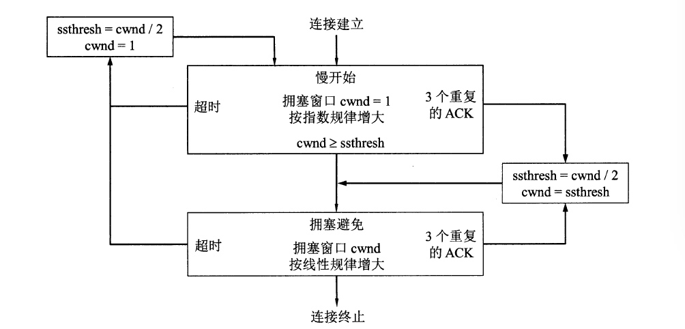

通过上面简单了解了 TCP 拥塞控制的方法,更详细的不再深入.通过拥塞控制和之前了解的确认报文首部的`窗口值`可以知道,发送方的发送窗口大小是`拥塞控制的窗口和确认报文首部的窗口值中较小的一个`.

# 连接管理

TCP 是基于连接的.那么连接是如何建立的?答案就是 3 次握手:
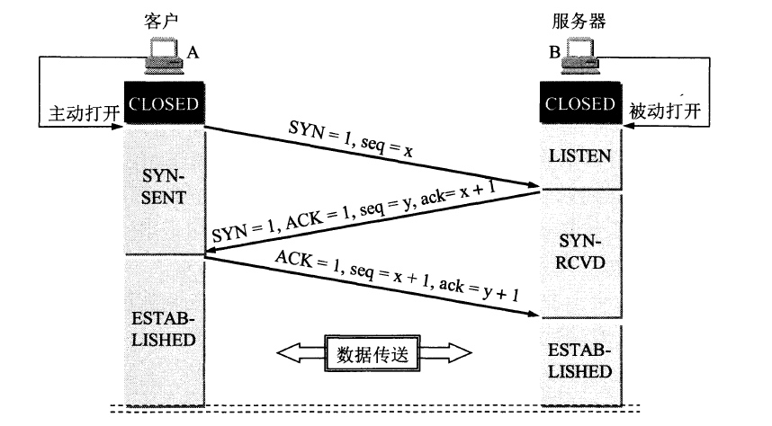

- 服务器是处于监听状态的，以便及时发现客户端建立连接的需求。
- 客户端 TCP 进程主动发出 Flag 段 SYN=1，报文序列号 seq=x 的报文段（A），请求建立连接。状态变为 SYN-SENT（同步已发送）。
- 服务器收到对应报文段（A）后，会发出确认报文段（B）。该报文（B）的 Flag 段的 SYN 和 ACK 都是 1，确认号 ack=x+1（意为对 A 的确认），同时设定自己的初始序列号 seq=y。状态由 LISTEN（监听）变为 SYN-RCVD（同步收到）。
- 客户端收到服务器的确认后，还需向服务器发送确认。报文段（C）的 Flag 的 ACK=1，确认号 ack=y+1（意为对 B 的确认），序列号 seq=x+1。状态变为 ESTABLISHED（已建立连接）。服务器在收到报文段后状态也变为 ESTABLISHED。
- 客户端的最后确认是必要的，可以防止以失效的请求建立连接报文突然到达服务器而产生错误。

下面再来看看连接是如何释放的：
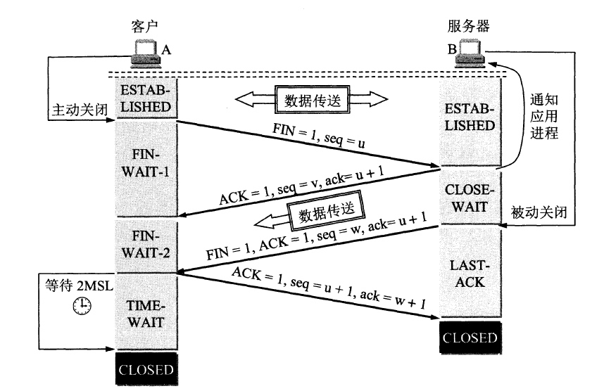

- 在连接建立完成，数据传输完毕后，通信的双发都是可以释放连接的。但通常情况，服务器都是被动的一端，客户端才知道，自己是不是真的没有数据要发送了。
- 在数据传输过程中，客户端和服务器都处于已建立连接的状态。
- 客户端 TCP 程序先发出连接释放报文（A），并停止发送数据。该报文的 Flag 位的 FIN=1，seq=u（等于其上一个序号+1）。客户端进入 FIN-WAIT-1 状态，等待服务器确认。
- 服务器接收到释放连接报文段后发出确认报文（B）Flag 位 ACK=1，确认号 ack=u+1，序列号 seq=v（等于其上一个序号+1）。服务器进入 WAIT（关闭等待）状态，这条 TCP 连接处于`半关闭状态`，也就是客户端到服务器方向的通道被关闭。
- 客户端在收到服务器的确认报文（B）后，进入 FIN-WAIT-2 状态，等待服务器发出连接关闭的报文。
- 若服务器也没有其他数据需要发送，就会向客户端发出释放连接的报文（C），Flag 端 FIN=1，ACK=1，确认号 ack=u+1（和报文 B 一样），序列号 seq=w（服务器可能在发出报文 B 之后又发送了数据，w 的值可能不是 v+1）。服务器进入 LAST-ACK 状态，等待客户端的确认。
- 客户端在收到服务器释放连接报文（C）后，发出确认报文（D）。Flag 段 ACK=1，确认号 ack=w+1，序列号 seq=u+1（报文 A 的 seq+1）。客户端进入 TIME-WAIT 状态。现在 TCP 连接并没有释放掉，必须等待 2 倍 MSL（最长报文段寿命 Maximum Segment Lifetime，该时长是由时间等待计时器设置）后才能关闭。
- 服务器收到报文 D 后，就可以关闭连接。
- 为何要等待 2MSL，客户端才能关闭连接
  - 保证客户端发出的报文 D 能够到达服务器。在报文 D 丢失的情况下，服务器未收到客户端的响应，所以会触发 TCP 的超时重传，而客户端可以在 2MSL 时间内收到重传的报文，并对之响应且重新启动 2MSL 计时器。最终，该连接可以正常关闭。
  - 防止失效的连接请求报文出现。可以保证在创建该 TCP 连接中发出的报文都在网络中消失。
- 关于 TCP 的保活计时器：在客户端服务器之间的 TCP 连接建立后，客户端突然故障，服务器也就无法再收到来自该客户端的任何报文，为了使服务器不会白白等待客户端而使用的措施是保活计时器。服务器每次收到客户端的数据就会重置保活计时器，时间 2 小时。若 2 小时未收到客户端的任何数据，服务器发送探测报文，每隔 75 秒一次，若连续 10 个探测报文都没有客户端的响应，该连接就会被服务器关闭。

# 结语

到这里,说明你有足够的耐心!奖励下自己!从上面可以看出,TCP 的滑动窗口是比较重要的,后面的流量控制和拥塞控制都是基于滑动窗口的.再后序文章中我们再一起继续学习.
