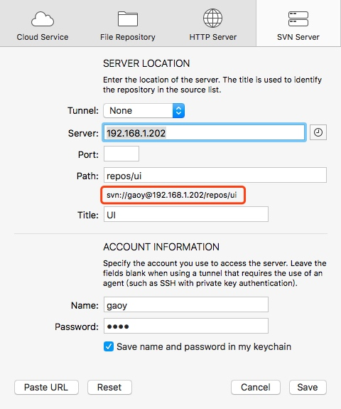
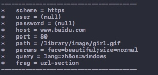

> 这是关于网络系列的第五篇文章,接下来会有更多精彩内容.敬请期待! 让我们一起乘风破浪!

# 前言
在浩瀚的互联网中，URL就是互联网资源的标准化名称。本节，让我们一起扒开URL的外衣！你可以了解到一下内容：

* URL语法，以及各种URL组件的含义以及其所做的工作
* URL和自动扩展URL
* URL编码和字符规则

# URL的用途
之前说URL是统一资源定位符，视乎它只是用来标识资源的位置似得。其实，不止如此！`URL为用户及他们的浏览器提供的找到信息所需的所有条件，包括它位于何处，以及如何获取它或者说如何处理它`。

# URL语法
`<scheme>://<user>:<password>@<host>:<port>/<path>;<params>?<query>#<frag>`

下面是Cornerstone的一个目录的配置:


可以看到红色框中的URL包含了`user`信息,密码为了安全并没有显示出来.


上面是一个URL的通用格式，当然几乎没有哪个URL包含了所有这些组件。最重要的3部分是:`scheme`,`host`,`path`.下面是各部分的说明:

|组件|描述|默认值|
|---|---|---|
|scheme|访问服务器获取资源时使用的协议|无|
|user|访问资源时使用的用户名|无（匿名）|
| password |用户的密码，和用户名使用`:`分割|E-mail|
| host |资源服务器主机名或IP地址|无|
| port |资源服务器监听的端口，不同的scheme有不同的默认端口（HTTP使用80作为默认端口）|和scheme有关|
| path |服务器上的资源路径。路径与服务器和scheme有关|默认值|
| params |在某些scheme下指定输入参数，是键值对。可以有多个，使用`;`分割|默认值|
| query |该组件没有通用的格式，HTTP中大多使用`&`来分隔多个query。使用`?`分隔query和其他部分|无|
| frag（或fragment）|一小片或一部分资源名称。引用对象时，不会将fragment传送给服务器，客户端内部使用。通过`#`分隔fragment和其余部分|无|
  印象中，一个带有参数的URL，会把参数拼接到URL后面，使用`?`和前面的隔开，现在看来，拼接的是query啊！看看下面代码片段的输出:
```
NSURL *aUrl = [NSURL URLWithString:@"https://www.baidu.com:80/library/image/girl.gif;face=beautiful;size=normal?lang=zh&os=windows#url-section"];
// 为了输出好看，加入了分隔字符
NSLog(@"\n---------------------------------------\n*\tscheme = %@\n*\tuser = %@\n*\tpassword = %@\n*\thost = %@\n*\tport = %@\n*\tpath = %@\n*\tparams = %@\n*\tquery = %@\n*\tfrag = %@\n---------------------------------------", aUrl.scheme, aUrl.user, aUrl.password, aUrl.host, aUrl.port, aUrl.path, aUrl.parameterString, aUrl.query, aUrl.fragment);
```

看到上述结果，若你之前的认识有误，请更正！
##### Tips
* scheme部分是大小写无关的
* HTTP的下层是TCP，默认端口80
* 路径是可以由多部分组成的，每一部分可以拥有自己的参数。如`/hammers;sale=false/index.html;graphics=true`
* 也许我们在实际运用中用query组件来充当了params组件；但注意，实际`?`后面的是query组件。
* 对应fragment组件来说，服务器通常指处理整个对象，在请求时服务器不会接受到该组件，它只是客户端使用的

# URL快捷方式
* 相对URL<br/>URL有两种方式：`绝对的`和`相对的`。之前的示例都是绝对的，就是从头到尾写全的；而相对的，是需要一个参照URL，被称为`基础`（NSURL类中有该属性`baseURL`）,相对URL在HTML开发中比较常见。
* 自动扩展URL<br/>浏览器自动扩展scheme、主机名、或根据历史记录扩展。用户无需输入完整的URL。

# 令人头疼的字符
URL作为互联网资源的标识，必须是可移植的、完整的。意思就是说，一个URL确定后，不管如何复制粘贴，这个URL的信息不能丢失！但是，URL使用的编码是`ASCII`，中文是不支持的（当然，不止是中文这么简单，ASCII无法表示所有字符这才是硬伤）。为了使用ASCII，又要支持其他字符，所以，`编码`就来了。其实这种`编码`就是`转义`，使用A代表B（比如URL中包含的类似`%7E`符号，就是转义之后的，代表着`~`这个特殊符号）。另外，还有一些特殊的保留字符（就像C语言中的关键字一样），若在保留场合之外使用需要编码。下面列举了这些字符：

|特殊字符|说明|
|:--:|:--:|
|`%`|作为转义标志|
|`.` 、`..`|路径组件，分别表示当前目录，和上级目录|
|`#`、`?`、`;`、`:`|分别是fragment分割符，query分隔符，参数分隔符，scheme等分隔符|
|`$`、`+`|保留|
|`@`、`&`、`=`|在不同scheme中有特殊含义|
|`{}`、`\|`、`\`、`^`、`[]`|使用受限|
|`<>`、`"`|不安全|
|`0x00-0x1F`、`>=0x7F`|无法打印，超出ASCII字符集的7位二进制范围|

下面看一段代码:

```
    NSString *scheme = @"HTTP";
    NSString *user = @"gaoy";
    NSString *password = @"123456";
    NSString *host = @"www.goyaya.米西米西";
    NSString *port = @"80";
    NSString *path = @"/image/gif/a.gif";
    NSString *params = @"face=beautiful;seze=normal";
    NSString *query = @"language=zh&os=macOS";
    NSString *frag = @"url-section";
    // 若host不进行编码,生成的URL将为空
    NSString *urlString = [NSString stringWithFormat:@"%@://%@:%@@%@:%@%@;%@?%@#%@",
                           scheme, user, password,
                           [host stringByAddingPercentEncodingWithAllowedCharacters:[NSCharacterSet URLHostAllowedCharacterSet]],
                           port, path, params, query, frag];
    NSLog(@"%@", urlString);
    NSURL *url = [NSURL URLWithString:urlString];
    NSLog(@"%@\n\n\n", url.absoluteString);
    // 解码
    NSLog(@"%@", url.absoluteString.stringByRemovingPercentEncoding);
```

从代码可以看出, OC的库中, 给出了URL每个组成部分的允许字符集(在`NSCharacterSet` 的`NSURLUtilities`扩展中, Swift可以使用`string.addingPercentEncoding(withAllowedCharacters:)`方法进行特定部分的编码,使用`string.removingPercentEncoding`解码)

详细的讨论看[这里](http://www.cnblogs.com/hushuai-ios/p/5500162.html)

# 结语
该篇中,我们主要了解了URL的组成部分. 下篇将介绍和HTTP报文相关的知识,希望大家一起学习.