# iOS Roadmap

## 计算机基础

### 网络

#### 总览

1. [七层模型](https://ios.nobady.cn/Network.html)
2. [网络篇](https://juejin.cn/post/6844904202523639822#heading-16)
3. [网络篇](https://juejin.cn/post/6844904202523639822#heading-0)

推荐库`Alarmfire`

#### HTTP(s)

1. [Http 和 Https 的区别？](https://ios.nobady.cn/Network.html#_2-http-和-https-的区别？https为什么更加安全？)
2. [HTTP(S)链接的建立流程](https://ios.nobady.cn/Network.html#_3-https的连接建立流程)
3. [图解HTTPS](https://juejin.cn/post/6844903608421449742)

#### NDS

[解析流程](https://juejin.cn/post/6844904202523639822#heading-9)

#### TCP

1. [总览](https://juejin.cn/post/6844903543623647246)

#### UDP

1. [总览](https://juejin.cn/post/6844903543170662408)

#### IP

1. [总览](https://juejin.cn/post/6844903543011442695)

### 数据结构与算法

[剑指Offer](https://leetcode-cn.com/study-plan/lcof/?progress=p5p2qrr)

## iOS相关

### --Objective-C--

#### property

##### 1. property默认修饰有哪些？

1. 从原子性(atomic、nonatomic)、读写权限(readonly、readwrite)、内存语义(assign、strong、weak、copy)、存取方法(setter=xx, getter=xx)、是否可能为空（nullable, nonnull）方面思考
2. 基本数据类型：atomic, readwrite, assign
3. 引用类型：atomic, readwrite, strong
4. `@property (class) int x;` 类属性，iOS10之后支持。但不会自动合成，需要自己使用`@dynamic`实现。
5. 参考[property修饰符详解](https://www.jianshu.com/p/da797678ef95)

##### 2. property 本质是什么？ivar、getter、setter 是如何生成并添加到这个类中的?
    
`@property = ivar + getter + setter;` 就是实例变量和存取方法。
    
完成属性定义后，编译器会自动编写访问这些属性所需的方法，此过程叫做“自动合成”(autosynthesis)。需要强调的是，这个过程由编译 器在编译期执行，所以编辑器里看不到这些“合成方法”(synthesized method)的源代码。除了生成方法代码 getter、setter 之外，编译器还要自动向类中添加适当类型的实例变量，并且在属性名前面加下划线，以此作为实例变量的名字。在前例中，会生成两个实例变量，其名称分别为 _firstName 与 _lastName。也可以在类的实现代码里通过 @synthesize 语法来指定实例变量的名字.

##### 3. 什么情况使用 weak 关键字，相比 assign 有什么不同？
1. `weak`常用来防止循环引用的产生，比如`delegate`、`block`、`timer`等。使用他们作为修饰符时，都不会对其引用对象的引用计数产生印象。weak只能修饰引用类型，会在其引用对象销毁时，自定置空；assignm没有类型限制，但作用在对象时，不会有置空效果。
2. weak singleton
    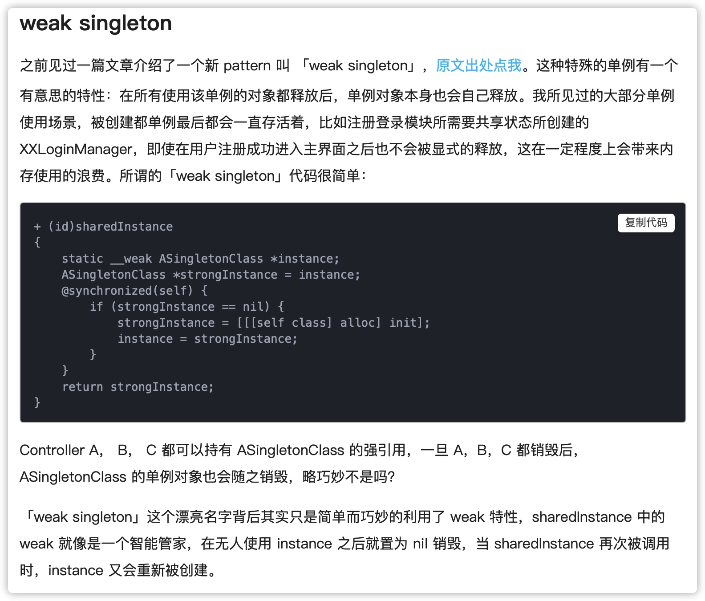

3. weak association object
  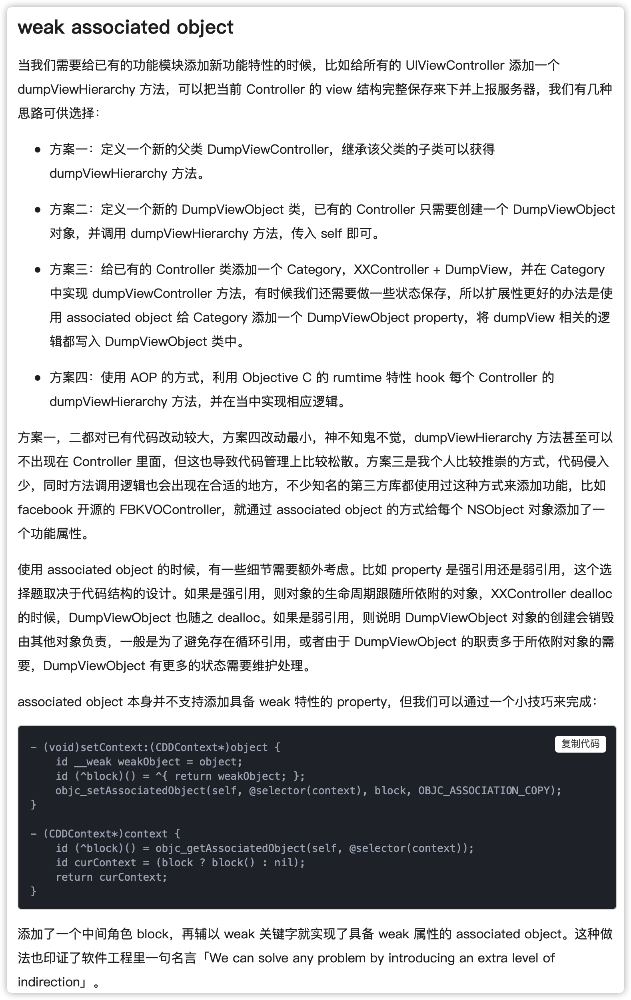

> 参考链接http://www.cocoachina.com/articles/19857

##### 4. 怎么用 copy 关键字？
1. NSString、NSArray、NSDictionary 等等经常使用copy关键字，是因为他们有对应的可变类型：NSMutableString、NSMutableArray、NSMutableDictionary；
2. Block类型也常使用copy。

##### 5. 对NSMutableString、NSMutableArray、NSMutableDictionary类型使用了copy修饰，会发生什么？
调用修改方法时会奔溃。copy会在赋值时对原对象进行复制，而这个复制操作会产生对应的不可变对象。不可变对象上自然没有对应的修改方法。

##### 6. @property (atomic) NSString *name; 的原子属性如何实现的？
编译器在实现对应setter/getter时会加上互斥锁。但这并不能保证多线程环境下的安全：一个线程在连续多次读取某属性值的过程中，别的线程依然可以同时改写该值，那么即便将属性声明为 atomic，也还是会读到不同的属性值。
    
原子性：一个操作要么不做，要么完全做完，保证连续性。
线程安全：多线程环境下对临界区资源的访问。

##### 7. protocol 和 category 中如何使用 property
1. 在 protocol 中使用 property 只会生成 setter 和 getter 方法声明,我们使用属性的目的,是希望遵守我协议的类能实现该属性(synthesize)。
2. category 使用 @property 也是只会生成 setter 和 getter 方法的声明,如果我们真的需要给 category 增加属性的实现,需要借助于运行时的两个函数：`objc_setAssociatedObject`和`objc_getAssociatedObject`

##### 8. @synthesize和@dynamic分别有什么作用？
1. @property有两个对应的词，一个是 @synthesize，一个是 @dynamic。默认是`@syntheszie var = _var; + setter/getter`
2. @dynamic告诉编译器不要自动生成，需要自己提供。若声明@dynamic后，自己没有提供相应实现（自己提供setter/getter或者通过runtime生成），编译时不会报错，但运行时会崩溃。

##### 9. 在有了自动合成属性实例变量之后，@synthesize还有哪些使用场景？
1. 同时重写了属性的setter/getter后，不会自动合成ivar，需要手动合成：`@synthesize var = _var`
2. 在 @protocol 中定义的属性需要使用`@synthesize`
    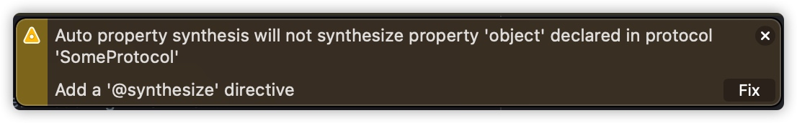
3. 重写父类的属性。子类中声明父类已有的属性，需要使用@synthesize合成。
    
#### 对象

##### 1. 对象的内存布局，其本质是什么？
在runtime中，对象就是一个结构体。其内存空间只包含isa+成员变量。若有父类，父类的成员变量会在子类之前。如下：


##### 2. 如何让自己的类用 copy 修饰符？

若想令自己所写的对象具有拷贝功能，则需实现 NSCopying 协议。如果自定义的对象分为可变版本与不可变版本，那么就要同时实现 NSCopying 与 NSMutableCopying 协议。
    
```oc
@protocol NSCopying
- (id)copyWithZone:(nullable NSZone *)zone;
@end

@protocol NSMutableCopying
- (id)mutableCopyWithZone:(nullable NSZone *)zone;
@end
```
##### 3. 如何重写带 copy 关键字的 setter？

```oc
@property (nonatomic, readwrite, copy) NSString *name;
- (void)setName:(NSString *)name {
    _name = [name copy];
}
```
##### 4. 对象的浅拷贝、深拷贝
1. 对 immutable 对象进行 copy 操作，是指针复制，mutableCopy 操作时内容复制；对 mutable 对象进行 copy 和 mutableCopy 都是内容复制。
2. 集合类型，其中的元素不会被复制。

#### KVO
#### KVC
#### Category
#### Association

#### Block

##### 1. 分类
    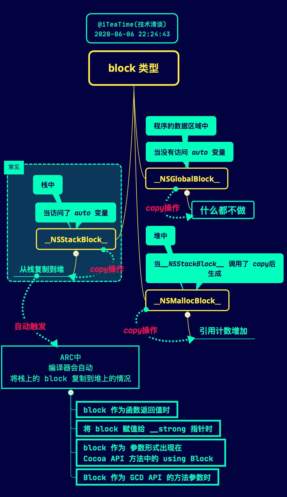

##### 2. 什么情况下使用Block会出现循环引用？如何解决

一个对象强引用了`Block`，这个`Block`又强引用了这个对象，就会产生循环引用。

`通常`使用`__weak`关键字来解决循环引用。在`Block`外部将想引用的对象定义`weak`引用，然后再`Block`内部使用这个`weak`引用。若避免在使用过程中防止`weak`变量释放，可以使用局部强指针再次引用使用的对象。

`unsafe_unretained`也可以解决该问题，但不安全，会产生野指针。`__block`也可以达到目的，但需要手动置空。

##### 3. 变量捕获机制
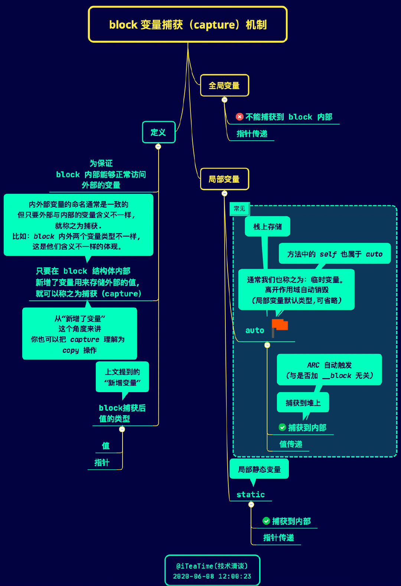

为了在Block内部正常访问其需要的变量，所以需要有“捕获”过程。
> 来源 https://juejin.cn/post/6988533484524404773


##### 4. `__block`实现原理

`__block`会将该类型的变量包装成对象。如下图：
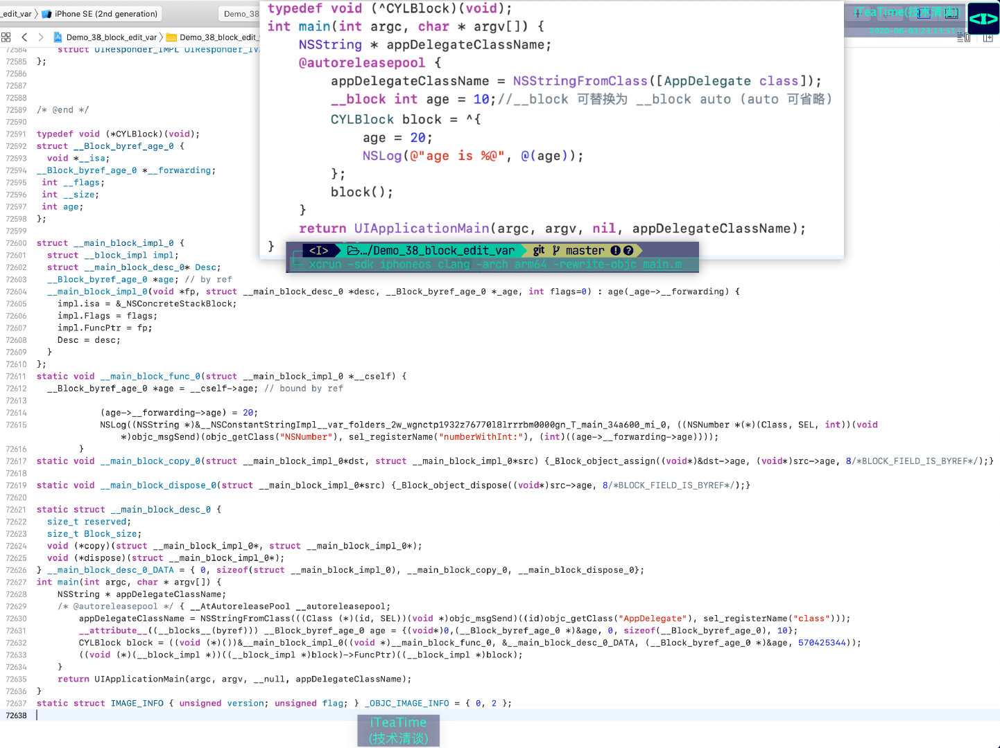

这里定义的`__block int age = 10`在转写后变为`__Block_byref_age_0`类型的结构体。其中`__forwarding`指针，为了统一`Block`被复制后，栈和堆中的`__block`变量的内存地址。如下图：
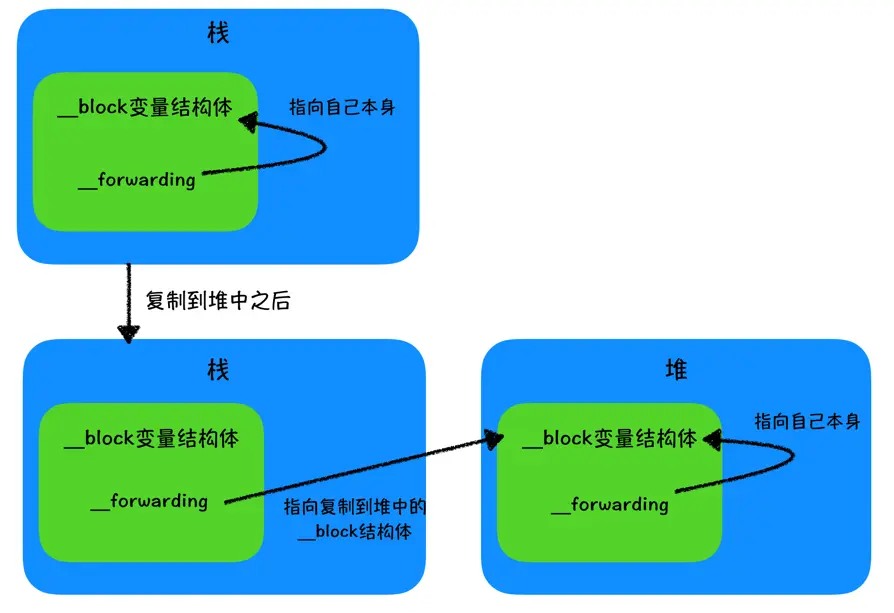


#### Runloop

##### 1. runloop和线程有什么关系？
1. runloop和线程是一一对应的关系，一个线程有且只有一个runloop。一般情况下，一条线程在执行完任务后会销毁。而runloop就是为了保活线程，让其能够很好的处理各种任务，并且在没有任务时进入休眠状态随时待命。
2. 线程的runloop只有在获取之后系统自动创建。主线程的runloop会由系统自动开启。子线程的runloop需要通过`[NSRunLoop currentRunLoop]`来获取。

##### 2. runloop底层结构

> [从这里摘抄整理](https://blog.ibireme.com/2015/05/18/runloop/#base)

```oc
struct __CFRunLoop {
    CFMutableSetRef _commonModes;     // Set
    CFMutableSetRef _commonModeItems; // Set<Source/Observer/Timer>
    CFRunLoopModeRef _currentMode;    // Current Runloop Mode
    CFMutableSetRef _modes;           // Set
    ...
};
```

一个 RunLoop 包含若干个 Mode，每个 Mode 又包含若干个 Source/Timer/Observer。每次运行 RunLoop 时，只能指定其中一个 Mode，这个Mode被称作 CurrentMode。如果需要切换 Mode，只能退出 Loop，再重新指定一个 Mode 进入。这样做主要是为了分隔开不同组的 Source/Timer/Observer，让其互不影响。

1. `CFRunLoopSourceRef`是事件产生的地方。Source有两个版本：Source0 和 Source1:
    1. Source0 只包含了一个回调函数指针，它并不能主动触发事件。使用时，你需要先调用 CFRunLoopSourceSignal(source)，将这个 Source 标记为待处理，然后手动调用 CFRunLoopWakeUp(runloop) 来唤醒 RunLoop，让其处理这个事件。
    2. Source1 包含了一个 mach_port 和一个回调函数指针，被用于通过内核和其他线程相互发送消息。这种 Source 能主动唤醒 RunLoop 的线程。
2. `CFRunLoopTimerRef` 是基于时间的触发器，它和 NSTimer 是toll-free bridged 的，可以混用。其包含一个时间长度和一个回调（函数指针）。当其加入到 RunLoop 时，RunLoop会注册对应的时间点，当时间点到时，RunLoop会被唤醒以执行那个回调。
3. `CFRunLoopObserverRef` 是观察者，每个 Observer 都包含了一个回调（函数指针），当 RunLoop 的状态发生变化时，观察者就能通过回调接受到这个变化。可以观测的时间点有以下几个：
    
    ```oc
    typedef CF_OPTIONS(CFOptionFlags, CFRunLoopActivity) {
        kCFRunLoopEntry         = (1UL << 0), // 即将进入Loop
        kCFRunLoopBeforeTimers  = (1UL << 1), // 即将处理 Timer
        kCFRunLoopBeforeSources = (1UL << 2), // 即将处理 Source
        kCFRunLoopBeforeWaiting = (1UL << 5), // 即将进入休眠
        kCFRunLoopAfterWaiting  = (1UL << 6), // 刚从休眠中唤醒
        kCFRunLoopExit          = (1UL << 7), // 即将退出Loop
    };
    ```
这里的 Source/Timer/Observer 被统称为 mode item，一个 item 可以被同时加入多个 mode。但一个 item 被重复加入同一个 mode 时是不会有效果的。**如果一个 mode 中一个 item 都没有，则 RunLoop 会直接退出，不进入循环**。

###### CFRunLoopMode

```oc
struct __CFRunLoopMode {
    CFStringRef _name;            // Mode Name, 例如 @"kCFRunLoopDefaultMode"
    CFMutableSetRef _sources0;    // Set
    CFMutableSetRef _sources1;    // Set
    CFMutableArrayRef _observers; // Array
    CFMutableArrayRef _timers;    // Array
    ...
};
```
“CommonModes”：一个 Mode 可以将自己标记为”Common”属性（通过将其 ModeName 添加到 RunLoop 的 “commonModes” 中）。每当 RunLoop 的内容发生变化时，RunLoop 都会自动将 _commonModeItems 里的 Source/Observer/Timer 同步到具有 “Common” 标记的所有Mode里。

###### workflow


```oc
/// 用DefaultMode启动
void CFRunLoopRun(void) {
    CFRunLoopRunSpecific(CFRunLoopGetCurrent(), kCFRunLoopDefaultMode, 1.0e10, false);
}
 
/// 用指定的Mode启动，允许设置RunLoop超时时间
int CFRunLoopRunInMode(CFStringRef modeName, CFTimeInterval seconds, Boolean stopAfterHandle) {
    return CFRunLoopRunSpecific(CFRunLoopGetCurrent(), modeName, seconds, returnAfterSourceHandled);
}
 
/// RunLoop的实现
int CFRunLoopRunSpecific(runloop, modeName, seconds, stopAfterHandle) {
    
    /// 首先根据modeName找到对应mode
    CFRunLoopModeRef currentMode = __CFRunLoopFindMode(runloop, modeName, false);
    /// 如果mode里没有source/timer/observer, 直接返回。
    if (__CFRunLoopModeIsEmpty(currentMode)) return;
    
    /// 1. 通知 Observers: RunLoop 即将进入 loop。
    __CFRunLoopDoObservers(runloop, currentMode, kCFRunLoopEntry);
    
    /// 内部函数，进入loop
    __CFRunLoopRun(runloop, currentMode, seconds, returnAfterSourceHandled) {
        Boolean sourceHandledThisLoop = NO;
        int retVal = 0;
        do {
            /// 2. 通知 Observers: RunLoop 即将触发 Timer 回调。
            __CFRunLoopDoObservers(runloop, currentMode, kCFRunLoopBeforeTimers);
            /// 3. 通知 Observers: RunLoop 即将触发 Source0 (非port) 回调。
            __CFRunLoopDoObservers(runloop, currentMode, kCFRunLoopBeforeSources);
            /// 执行被加入的block
            __CFRunLoopDoBlocks(runloop, currentMode);
            
            /// 4. RunLoop 触发 Source0 (非port) 回调。
            sourceHandledThisLoop = __CFRunLoopDoSources0(runloop, currentMode, stopAfterHandle);
            /// 执行被加入的block
            __CFRunLoopDoBlocks(runloop, currentMode);
 
            /// 5. 如果有 Source1 (基于port) 处于 ready 状态，直接处理这个 Source1 然后跳转去处理消息。
            if (__Source0DidDispatchPortLastTime) {
                Boolean hasMsg = __CFRunLoopServiceMachPort(dispatchPort, &msg)
                if (hasMsg) goto handle_msg;
            }
            
            /// 通知 Observers: RunLoop 的线程即将进入休眠(sleep)。
            if (!sourceHandledThisLoop) {
                __CFRunLoopDoObservers(runloop, currentMode, kCFRunLoopBeforeWaiting);
            }
            
            /// 7. 调用 mach_msg 等待接受 mach_port 的消息。线程将进入休眠, 直到被下面某一个事件唤醒。
            /// • 一个基于 port 的Source 的事件。
            /// • 一个 Timer 到时间了
            /// • RunLoop 自身的超时时间到了
            /// • 被其他什么调用者手动唤醒
            __CFRunLoopServiceMachPort(waitSet, &msg, sizeof(msg_buffer), &livePort) {
                mach_msg(msg, MACH_RCV_MSG, port); // thread wait for receive msg
            }
 
            /// 8. 通知 Observers: RunLoop 的线程刚刚被唤醒了。
            __CFRunLoopDoObservers(runloop, currentMode, kCFRunLoopAfterWaiting);
            
            /// 收到消息，处理消息。
            handle_msg:
 
            /// 9.1 如果一个 Timer 到时间了，触发这个Timer的回调。
            if (msg_is_timer) {
                __CFRunLoopDoTimers(runloop, currentMode, mach_absolute_time())
            } 
 
            /// 9.2 如果有dispatch到main_queue的block，执行block。
            else if (msg_is_dispatch) {
                __CFRUNLOOP_IS_SERVICING_THE_MAIN_DISPATCH_QUEUE__(msg);
            } 
 
            /// 9.3 如果一个 Source1 (基于port) 发出事件了，处理这个事件
            else {
                CFRunLoopSourceRef source1 = __CFRunLoopModeFindSourceForMachPort(runloop, currentMode, livePort);
                sourceHandledThisLoop = __CFRunLoopDoSource1(runloop, currentMode, source1, msg);
                if (sourceHandledThisLoop) {
                    mach_msg(reply, MACH_SEND_MSG, reply);
                }
            }
            
            /// 执行加入到Loop的block
            __CFRunLoopDoBlocks(runloop, currentMode);
            
 
            if (sourceHandledThisLoop && stopAfterHandle) {
                /// 进入loop时参数说处理完事件就返回。
                retVal = kCFRunLoopRunHandledSource;
            } else if (timeout) {
                /// 超出传入参数标记的超时时间了
                retVal = kCFRunLoopRunTimedOut;
            } else if (__CFRunLoopIsStopped(runloop)) {
                /// 被外部调用者强制停止了
                retVal = kCFRunLoopRunStopped;
            } else if (__CFRunLoopModeIsEmpty(runloop, currentMode)) {
                /// source/timer/observer一个都没有了
                retVal = kCFRunLoopRunFinished;
            }
            
            /// 如果没超时，mode里没空，loop也没被停止，那继续loop。
        } while (retVal == 0);
    }
    /// 10. 通知 Observers: RunLoop 即将退出。
    __CFRunLoopDoObservers(rl, currentMode, kCFRunLoopExit);
}
```

##### 3. AutoreleasePool和Runloop
1. 即将进入`Runloop`时，push新的`AutoreleasePool`
2. 退出`Runloop`时，pop`AutoreleasePool`。和步骤1对应
3. 每次事件循环休眠之前会pop旧的，保证该次循环中产生的自动释放对象；之后会创建新的`AutoreleasePool`

> 上面[参考这里](https://developer.apple.com/documentation/foundation/nsautoreleasepool#//apple_ref/doc/uid/TP40003623)

#### Thread&GCD

##### GCD队列类型

1. 并发队列。可以让多个任务并发执行，但只能在异步函数(`dispatch_async`)下才有效。创建方式：`dispatch_queue_create("com.CJL.Queue", DISPATCH_QUEUE_CONCURRENT);`或`dispatch_get_global_queue(0, 0);`
2. 串行队列。任务一个接一个的执行。创建方式`dispatch_queue_create("name", DISPATCH_QUEUE_SERIAL(NULL));`

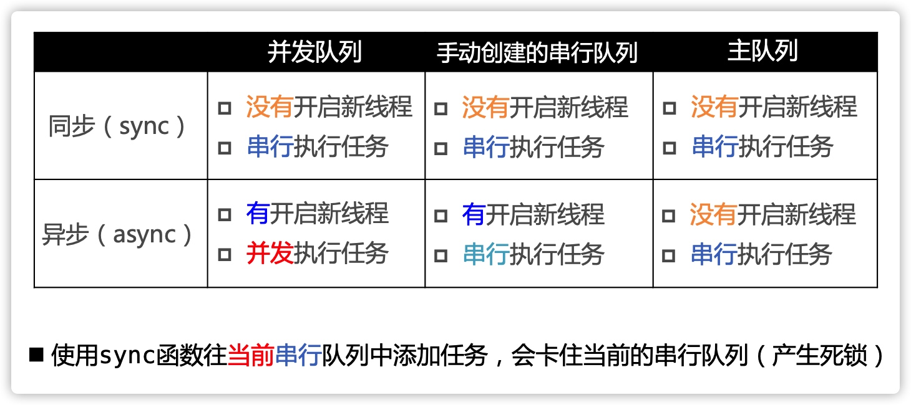

##### NSOperation
> 参考 https://developer.apple.com/documentation/foundation/nsoperation?language=objc

1. `NSOperation`默认是同步的，它不会在内部再创建新的线程执行任务。
2. `NSOperation`可以直接使用，通过`start`方法启动，也可以添加到`NSOperationQueue`中，由系统进行调度。
3. 若你的`NSOperation`只会在`NSOperationQueue`中使用，可以直接将其设计为`同步的`；若考虑直接使用，也可以设计成`异步的`，这样它就不会阻塞其调用线程。但是需要覆写下面的方法：
    1. start, 启动线程执行任务，并以支持KVO的方式更新`isExecuting`属性。


##### 分析打印结果1

```oc
- (void)test {
    NSLog(@"2");
}

dispatch_queue_t queue = dispatch_get_global_queue(0, 0);
dispatch_async(queue, ^{
    NSLog(@"1");
    [self performSelector:@selector(test) withObject:nil afterDelay:0.0];
    NSLog(@"2");
});
```
输出1、3。
`-[NSObject performSelector:withObject:afterDelay:]`本质上是添加定时器，但子线程的`Runloop`没没有开启，定时器将不会执行。


##### 分析打印结果2
```oc
- (void)test {
    NSLog(@"2");
}

-(void)touchesBegan:(NSSet<UITouch *> *)touches withEvent:(UIEvent *)event {
    NSThread *thread = [[NSThread alloc] initWithBlock:^{
        NSLog(@"1");
    }];
    [thread start];
    
    [self performSelector:@selector(test) onThread:thread withObject:nil waitUntilDone:YES];
}
```
输出1后崩溃。
子线程在启动后，完成其任务，线程就结束了。无法再次使用。

#### 内存管理
    * https://www.jianshu.com/p/713106afd7ef
      
##### 0. 内存分布
 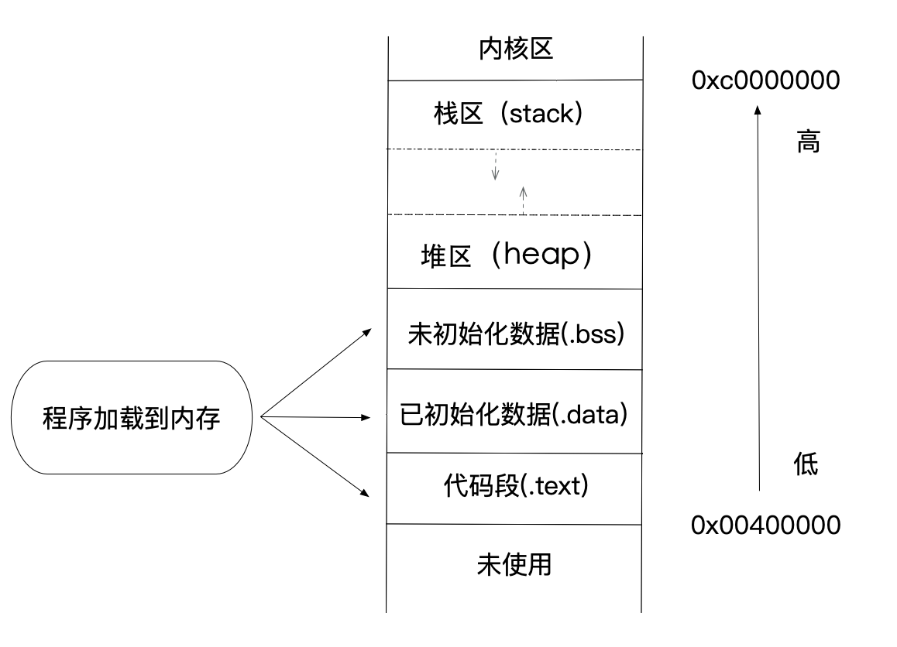

##### 1. runtime 如何实现 weak 属性
Runtime维护了`weak`哈希表，用于记录某个对象的所有weak引用，`key`是对象地址，`value`是`weak`指针地址数组。例如下面代码：

```oc
id obj0 = [NSObject new];
__weak id obj1 = obj0;
__weak id objA = obj0;
```

`key`是`obj0`，`value`就是包含`obj1`、`objA`地址(&obj1, &objA)的数组。

具体的：
1. 初始化`weak`：使用`objc_initWeak`函数。
2. 添加`weak`指针，使用`objec_storeWeak`函数记录在hash表中
3. 当`weak`指针执行的对象销毁时，会调用其`clearDeallocating`函数，该函数会根据其地址在hash表中查找`weak`指针，将其置空，并移除hash表
    
> [参考这里](https://github.com/alexz825/Algorithm/issues/37)

##### 2. weak属性需要在dealloc中置空吗？

对象在释放时，会检查该对象关联的weak指针，将其置空，并从weak表中删除。

> [参考这里](http://www.cocoachina.com/articles/18962)

##### 3. objc使用什么机制管理对象内存？

引用计数。当引用计数为0时，就说明对象可以释放了。

1. 成员变量的释放
    这个对象 dealloc 时候，成员变量 `objc_storeStrong(&ivar,nil)` 进行释放
2. 局部变量的释放
    1. strong类型的变量，在出作用域时释放。
    2. weak类型变量，出作用于时通过`objc_destroyWeak`删除weak引用
    3. autorelease类型的变量，跟随autoreleasePool进行释放。若自动使用了`@autoreleasepool{}`，在出作用域后会进行释放。若没有使用，依赖线程runloop中的autoreleasePool。

##### 4. ARC通过什么方式帮助开发者管理内存？
「引用计数式内存管理」的本质部分在 ARC 中并没有改变，ARC 只是自动帮我们处理了「引用计数」的相关部分。

###### 修饰符
1. `__strong` 默认情况下引用类型都是这种修饰符。一个对象只要有强指针引用，就不会被释放。一个强指针就相当于增加一个引用计数。在强指针作用域结束后减少引用计数。
2. `__weak` 弱指针，不会影响对象的引用计数，并且在指向的对象释放时，会自动置空`nil`
3. `__unsafe_unretain` 和`__weak`类似，但不会在引用的对象释放后自动置空
4. `__autoreleasing` 加入自动释放池

> [参考这里](https://juejin.cn/post/7008047831529308173)

##### 5. AutoreleasePool的实现原理

> 参考：https://juejin.cn/post/6844904094503567368

一段使用`AutoreleasePool`的代码：
```oc
int main(int argc, const char * argv[]) {
    @autoreleasepool {}
    return 0;
}
```
经过转写后成为：
```oc
struct __AtAutoreleasePool {
    __AtAutoreleasePool() {
        atautoreleasepoolobj = objc_autoreleasePoolPush();
    }
    ~__AtAutoreleasePool() {
        objc_autoreleasePoolPop(atautoreleasepoolobj);
    }
    void * atautoreleasepoolobj;
};

int main(int argc, const char * argv[]) {
    /* @autoreleasepool */ 
    { __AtAutoreleasePool __autoreleasepool;  }
    return 0;
}
```
这里通过`C++`结构体的构造及析构函数，完成`objc_autoreleasePoolPush()`和`objc_autoreleasePoolPop()`函数调用。而这两个函数最后会落脚到`AutoreleasePoolPage`类上。

###### AutoreleasePoolPage

这是一个双向链表结构：
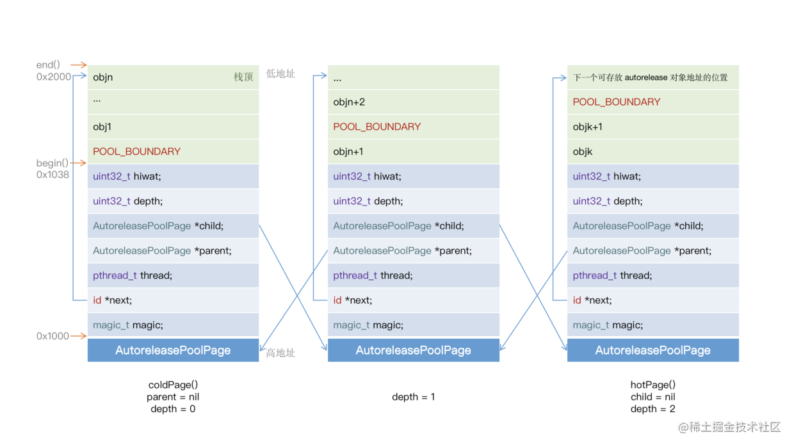

每一个节点占用`4k`的内存空间，除了自身支持数据字段外，其他空间都是用来存储`autorelease`对象地址的。

###### objc_autoreleasePoolPush&objc_autoreleasePoolPop
该函数会在`Page`中入栈一个`POOL_BOUNDARY`（其实就是nil）对象，然后将该对象地址返回，之后将这个地址传入`objc_autoreleasePoolPop`函数中，函数会从自动释放池中最后一个对象开始，依次给它们发送`release`消息，直到遇到这个`POOL_BOUNDARY`


##### 6. __bridge, __bridge_transfer, __bridge_retained

1. `__bridge`用以将 CF 对象转换为 OC 对象，或者 OC 对象转换为 CF 对象，但是不会对对象的 Retain Count、所有权产生任何影响。
2. `__bridge_transfer`等价于 CFBridgingRelease()，将 CF 对象转换为 OC 对象，并将所有权转移给 ARC。后续无需再手动对CF对象进行释放。
3. `__bridge_retained`等价于 CFBridgingRetain()，用以将 OC 对象转换为 CF 对象，并且 Retain Count 立即 +1。后续需要手动对该对象进行释放。


#### runtime

##### 1. isa&superclass指针
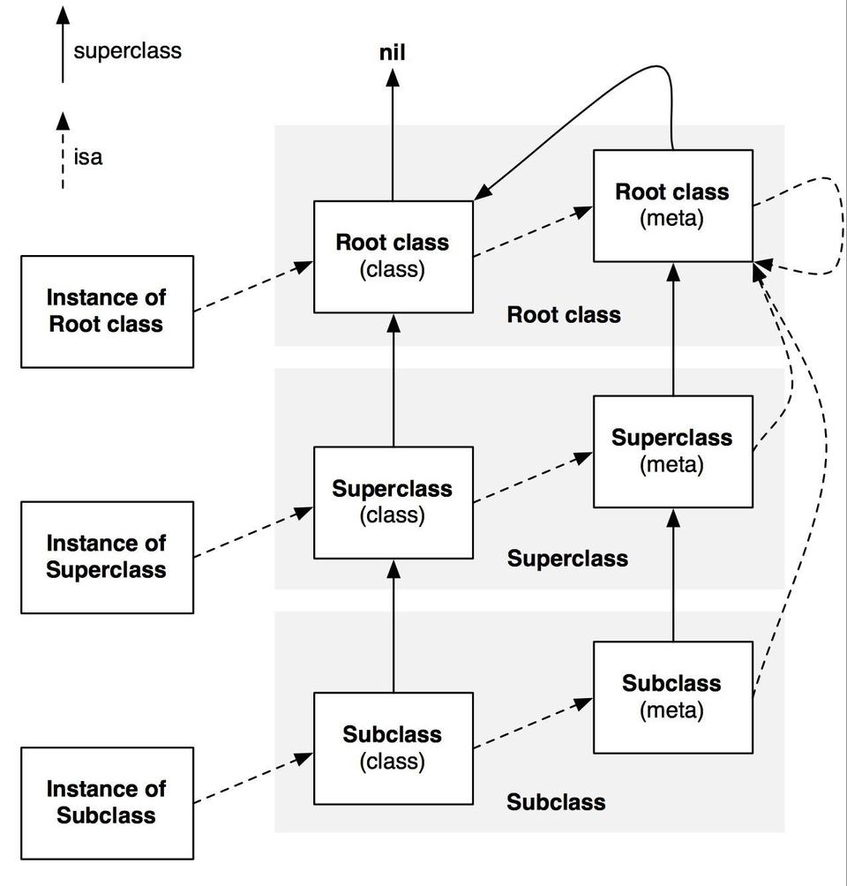

##### 2. object&class struct
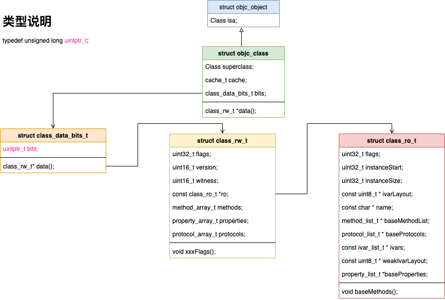

##### 3. 消息发送流程


`[receiver message]`方法调用会被转换为消息发送`objc_msgSend(receiver, message)`。具体步骤：
1. 检查接受者是否为nil，若为nil会直接返回
2. 通过isa查找类对象，然后查找类对象中的方法缓存列表，若找到就直接调用；否则下一步
3. 查找类对象的方法列表，若找到，就填充缓存，并调用；否则下一步
4. 根据superclass查找父类，缓存和方法列表，这个操作会持续到根类，若找到，就填充缓存，并调用；否则下一步
5. 动态方法解析。类的`+resolveInstanceMethod:(或+resolveClassMethod:)`会被调用，可以在这里动态添加方法实现，之后会重新进入2流程。动态方法解析对于每个方法只会调用一次。该过程之后还没找到方法的，进入下一步
6. 快速转发。`-(+)forwardingTargetForSelector:`返回可以处理该消息的其他对象（不能为nil或self），之后会使用返回的对象处理该消息。若该过程没有实现，进入下一步
7. 正常转发。这是最会一次处理机会。首先通过`-methodSignatureForSelector:`获取方法签名，若没有实现会进入下一步。获取到签名后，会继续通过`-forwardInvocation:`进行回调，这里可以进行自定义处理。
8. 奔溃，`doesNotRecognizeSelector`

##### 4. [super method]本质是什么？
`[object message]`或`[self message]`都会被转换成`objc_msgSend(id self, SEL selector)`调用，而`[super message]`会被转换成`objc_msgSendSuper(struct objc_super *super, SEL selector, ...)`调用。这里的`struct objc_super`如下：

```c
struct objc_super {
      __unsafe_unretained id receiver;
      __unsafe_unretained Class super_class;
};
```
所以对于`[super method]`，方法的接受者依然是`self`对象，只是查找方法实现的起点不是从`self`的类对象中查找，而是从`superclass`的类对象中查找。

##### 5. `_objc_msgForward(id, SEL, args...)`函数是做什么的，直接调用它将会发生什么？

`_objc_msgForward`是用来做消息转发的，直接调用它可以跳过消息查找流程，直接进入动态解析及后续流程。

> [具体参考](https://github.com/ChenYilong/iOSInterviewQuestions/blob/master/01《招聘一个靠谱的iOS》面试题参考答案/《招聘一个靠谱的iOS》面试题参考答案（下）.md#25-_objc_msgforward函数是做什么的直接调用它将会发生什么)

##### 6. 能否向编译后得到的类中增加实例变量？能否向运行时创建的类中添加实例变量？为什么？
1. 不能向编译后得到的类中增加实例变量；已经编译过的类，其实例变量已经确定，实例大小也都确定。若可以添加，已经创建的对象如何处理？就算有处理方法，实例化的对象千千万，也会是一个不小的工作量。
2. 能向运行时创建的类中添加实例变量；具体做法是：
    1. 使用`objc_allocateClassPair`创建新类。
    2. 使用`class_addIvar`添加实例变量，还可以使用`class_addMethod`添加方法等等...
    3. 使用`objc_registerClassPair`注册类；一旦注册，就不能再次改变类结构。

### --Swift--

### --UIKit--

1. 响应者链
2. UIApplication生命周期
3. UIViewController生命周期
4. UIView生命周期
5. UIView&CALayer
6. UIWindow
    1. 作为容器，本身不显示任何内容，其内容来源`rootViewController`.
    2. 事件传递媒介，向`rootViewController`分发事件

参考：
1. https://www.jianshu.com/p/c6b7302b7411

### NSNotification

### --优化技巧--

### --Cocoapods--

### 常用第三方库

#### Alarmfire

#### WebViewJavaScriptBridge

#### MJRefresh

#### SDWebImage

解读：https://www.jianshu.com/p/06f0265c22eb

## 软实力

### Git

### 设计模式

### 代码大全

### 架构能力

## 涉猎广度

### Linux

### Shell