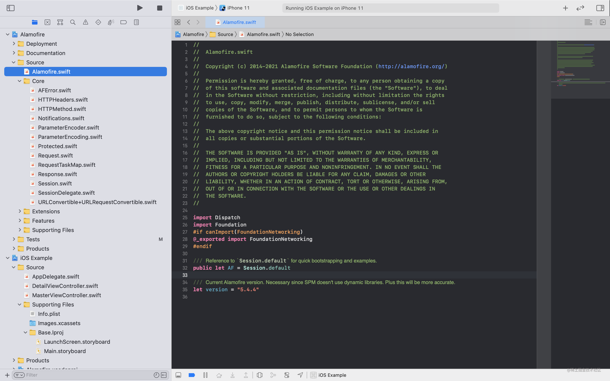
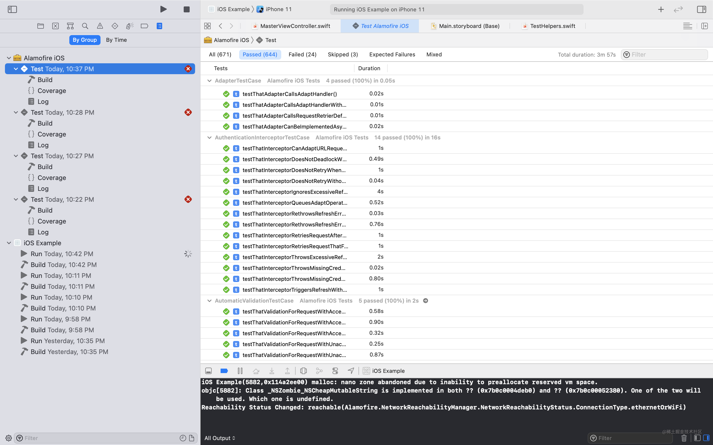
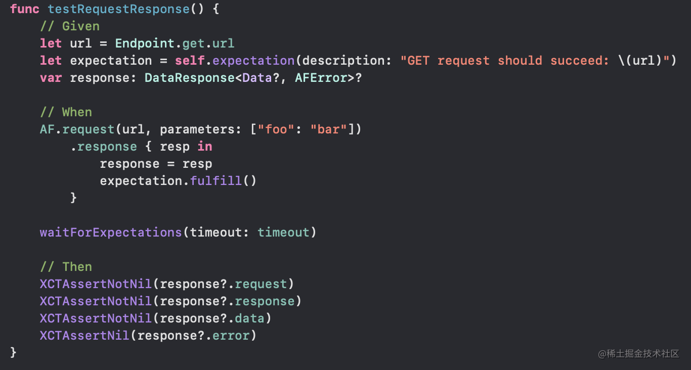

如今`Alamofire`可以说是`Swift`工程必备框架了。
本篇开始研究学习相关知识（`Alamofire 5.4.4`版本）。先看下工程总览：




从框架的代码结构来看，这里的内容应该不少。我们将目标分解，先研究其工作流程，认识下相关类，为后面的深入做准备。

## 巧用Test case

建议打开工程后，先翻一遍`Tests`文件夹，然后跑一遍所有的`Tests`，会有惊喜。别问我怎么知道的，都是泪啊。

**注意：在这之前，你需要做两件重要的事：**

1. 修改`Tests`文件夹下`TestHelpers.swift`中第`50`行的`httpbin.org`替换为`www.httpbin.org`
2. 还是这个文件的第`220`行的`Host.localhost`替换为`Host.httpBin`

这保证了你能连接到正确的`http`测试服务器。

好了，下面是我跑出的测试结果：




在这里会有各种各样的使用案例，敬请翱翔吧！

## 工作流程

本节，我们分析一个`testRequestResponse`测试用例，理清整个请求流程。这也是本篇的主要目标。




可以看到，在除去Test相关代码，核心就只有一句了：

```swift
AF.request(url, parameters: ["foo": "bar"]).response { resp in
  response = resp
}
```

这里主要做了两件事：

1. 创建`Request`
2. 使用`Request`发起请求

同时引出了我们需要了解的几个类：

### AF - Session类的全局实例对象

`Session`是`URLSession`的封装。主要负责创建并管理`Request`。同时它也负责请求队列/拦截/认证/重定向以及缓冲的管理。

### Request & DataRequest

`AF.request(url, parameters: ["foo": "bar"])`就是创建了一个`DataRequest`。而`DataRequest`继承于`Request`。

`Request`封装了一个请求信息，大致包含：请求状态，进度，事件回调等。

`DataRequest`基于`Request`增加了接收数据的功能，通过`mutableData`将收到的数据存储在内存中。

### DataResponse

`DataResponse`封装了相应相关信息。它是一个泛型结构体，定义了两个泛型`Success`、`Failure`分别代表请求成功和失败对于的数据类型。

对于测试用例的响应类型 `AFDataResponse<Data?>` 是一个类型别名：

```swift
public typealias AFDataResponse<Success> = DataResponse<Success, AFError>
```

它使用 `AFError`作为默认的错误类型。

### 连起来，串一串

好了，大致了解了相关数据类型。这里我们尝试把整体流程串起来。

首先是创建`Request`的流程。

需要说明的是`Request`分为以下几种类型：

1. `DataRequest`
2. `DataStreamRequest`
3. `DownloadRequest`
4. `UploadRequest`

其中`DataRequest`最为常用，其次就是上传下载了。`DataStreamRequest`表示还没接触过。。。

这几种`Request`都有对应的创建方法。（方法签名太长，就不贴了。）他们大多都有相同参数：
1. convertible - 请求对应的URL
2. method - 请求方法
3. parameters - 请求参数
4. encoding（或encoder） - 负责将参数编码进请求中
5. headers - 额外的请求头信息
6. interceptor - 拦截器，这个后面具体讲
7. requestModifier - 请求修改器，可以进一步修改Request

在收集的各种参数后，会封装到`RequestConvertible`或`RequestEncodableConvertible`中，这两个结构体都遵循了`URLRequestConvertible`协议，可以生成`URLRequest`。简单看下它们的实现：

```swift
struct RequestConvertible: URLRequestConvertible {
    let url: URLConvertible
    let method: HTTPMethod
    let parameters: Parameters?
    let encoding: ParameterEncoding
    let headers: HTTPHeaders?
    let requestModifier: RequestModifier?
    
    func asURLRequest() throws -> URLRequest {
        /// 构建Request
        var request = try URLRequest(url: url, method: method, headers: headers)
        /// 使用requestModifier对Request进一步定制
        try requestModifier?(&request)
        /// 将参数编码
        return try encoding.encode(request, with: parameters)
    }
}
```


```swift
struct RequestEncodableConvertible<Parameters: Encodable>: URLRequestConvertible {
    let url: URLConvertible
    let method: HTTPMethod
    let parameters: Parameters?
    let encoder: ParameterEncoder
    let headers: HTTPHeaders?
    let requestModifier: RequestModifier?

    func asURLRequest() throws -> URLRequest {
        /// 构建Request
        var request = try URLRequest(url: url, method: method, headers: headers)
        /// 使用requestModifier对Request进一步定制
        try requestModifier?(&request)
        
        /// 将参数编码
        return try parameters.map { try encoder.encode($0, into: request) } ?? request
    }
}
```

对比两份实现，只有关于编码方面的细微差别，这里先留个问号，可能必须深入到内部才能了解到这样设计的初衷。

其次是配置阶段。

创建好的`Request`会通过 `func perform(_ request: Request)`方法进行分发，根据不同类型的`Request`执行不同的配置方法：


```swift
func perform(_ request: Request) {
    rootQueue.async {
        /// 被取消了，就直接返回
        guard !request.isCancelled else { return }
        /// 记录活动的请求
        self.activeRequests.insert(request)

        self.requestQueue.async {
            // Leaf types must come first, otherwise they will cast as their superclass.
            /// 分发配置
            switch request {
            case let r as UploadRequest: self.performUploadRequest(r) // UploadRequest must come before DataRequest due to subtype relationship.
            case let r as DataRequest: self.performDataRequest(r)
            case let r as DownloadRequest: self.performDownloadRequest(r)
            case let r as DataStreamRequest: self.performDataStreamRequest(r)
            default: fatalError("Attempted to perform unsupported Request subclass: \(type(of: request))")
            }
        }
    }
}
```

各版本的配置方法最终又会落脚到这里：


```swift
func performSetupOperations(for request: Request,
                            convertible: URLRequestConvertible,
                            shouldCreateTask: @escaping () -> Bool = { true })
{
    /// 条件预检
    dispatchPrecondition(condition: .onQueue(requestQueue))

    let initialRequest: URLRequest

    do {
        /// URLRequestConvertible协议方法被调用，创建URLRequest
        initialRequest = try convertible.asURLRequest()
        /// 验证请求是否合法，默认实现是GET方法通过body传送数据被认为不合法
        try initialRequest.validate()
    } catch {
        /// 事件回调：合法性校验失败
        rootQueue.async { request.didFailToCreateURLRequest(with: error.asAFError(or: .createURLRequestFailed(error: error))) }
        return
    }
    /// 事件回调：已经创建请求
    rootQueue.async { request.didCreateInitialURLRequest(initialRequest) }
    /// 再次检查请求状态，取消就不再进行后续工作
    guard !request.isCancelled else { return }
    /// 获取Request的适配器，会考虑单个Request级别和Session级别
    guard let adapter = adapter(for: request) else {
        guard shouldCreateTask() else { return }
        /// 1.?
        rootQueue.async { self.didCreateURLRequest(initialRequest, for: request) }
        return
    }
    
    /// 默认情况下会走这里的逻辑，除非配置了interceptor
    
    let adapterState = RequestAdapterState(requestID: request.id, session: self)
    /// 适配Request，并进行后续处理
    adapter.adapt(initialRequest, using: adapterState) { result in
        do {
            /// 获取适配后的Request
            let adaptedRequest = try result.get()
            try adaptedRequest.validate()
            /// 事件回调：已经适配请求
            self.rootQueue.async { request.didAdaptInitialRequest(initialRequest, to: adaptedRequest) }

            guard shouldCreateTask() else { return }
            // 1.?
            self.rootQueue.async { self.didCreateURLRequest(adaptedRequest, for: request) }
        } catch {
            /// 事件回调：适配请求失败
            self.rootQueue.async { request.didFailToAdaptURLRequest(initialRequest, withError: .requestAdaptationFailed(error: error)) }
        }
    }
}
```

下面是最后的配置：


```swift
func didCreateURLRequest(_ urlRequest: URLRequest, for request: Request) {
    dispatchPrecondition(condition: .onQueue(rootQueue))
    /// 事件回调：已经创建URLRequest
    request.didCreateURLRequest(urlRequest)
    /// 取消后直接返回
    guard !request.isCancelled else { return }
    /// 创建task
    let task = request.task(for: urlRequest, using: session)
    /// 记录 request->task映射
    requestTaskMap[request] = task
    /// 事件回调：已经创建task
    request.didCreateTask(task)

    updateStatesForTask(task, request: request)
}
```

可以看到这里主要创建task。最后是对task的配置。（这次真的是最后一次配置了😂）：


```swift
func updateStatesForTask(_ task: URLSessionTask, request: Request) {
    dispatchPrecondition(condition: .onQueue(rootQueue))

    request.withState { state in
        switch state {
        case .initialized, .finished:
            // Do nothing.
            break
        case .resumed:
            task.resume()
            rootQueue.async { request.didResumeTask(task) }
        case .suspended:
            task.suspend()
            rootQueue.async { request.didSuspendTask(task) }
        case .cancelled:
            // Resume to ensure metrics are gathered.
            task.resume()
            task.cancel()
            rootQueue.async { request.didCancelTask(task) }
        }
    }
}
```

这里主要是同步`Request`的状态到`task`。

终于到这里创建一个Request的流程走完了！🤣

下一步是`resume`这个请求。`request.response { resp in xxx }`

这里的`response`方法定义在`ResponseSerialization.swift`文件`DataRequest`的一个扩展中:


```swift
@discardableResult
public func response(queue: DispatchQueue = .main, completionHandler: @escaping (AFDataResponse<Data?>) -> Void) -> Self {
    /// 添加一个响应序列化器，后面的Closure就是对于的序列化操作
    /// 添加的序列化器在系统回调`urlSession(_:task:didCompleteWithError:)`后会被执行
    appendResponseSerializer {
        /// 直接使用data和error构建result
        // Start work that should be on the serialization queue.
        let result = AFResult<Data?>(value: self.data, error: self.error)
        // End work that should be on the serialization queue.

        self.underlyingQueue.async {
            /// 构建response对象
            let response = DataResponse(request: self.request,
                                        response: self.response,
                                        data: self.data,
                                        metrics: self.metrics,
                                        serializationDuration: 0,
                                        result: result)
            /// 事件回调：已经解析响应
            self.eventMonitor?.request(self, didParseResponse: response)
            /// 添加一个所有序列化器完成后的回调，以便将本方法回调出去
            self.responseSerializerDidComplete { queue.async { completionHandler(response) } }
        }
    }

    return self
}
```

`response`方法的变体有多种，分别用于请求不同的数据类型：

1. 将请求数据解析为`String`的`responseString`
2. 将请求数据解析为`JSON`的`responseJSON`
3. 将请求数据解析为模型的`responseDecodable`
4. 。。。

这些不同的版本本质上是使用`appendResponseSerializer(_:)`方法添加了不同的解析器。


```swift
func appendResponseSerializer(_ closure: @escaping () -> Void) {
    /// $mutableState是属性包装器的使用，这里是为了线程安全。具体的使用方法放在后面再说。
    $mutableState.write { mutableState in
        /// 使用数组记录序列化器
        mutableState.responseSerializers.append(closure)
        /// 若之前的序列化器都已经调用完毕，这里又添加了一个，需要重置状态到resumed
        if mutableState.state == .finished {
            mutableState.state = .resumed
        }
        /// 若之前的序列化器都执行完毕，需要处理本次添加的
        if mutableState.responseSerializerProcessingFinished {
            underlyingQueue.async { self.processNextResponseSerializer() }
        }
        /// resume 该请求
        if mutableState.state.canTransitionTo(.resumed) {
            underlyingQueue.async { if self.delegate?.startImmediately == true { self.resume() } }
        }
    }
}
```

## 总结

好了，今天我们大致熟悉了Alamofire的请求流程，明白的一个请求从创建到发起是如何进行的。后续我会顺着这个思路，逐步分析该流程种的细节部分。敬请期待。感谢大家的阅读！