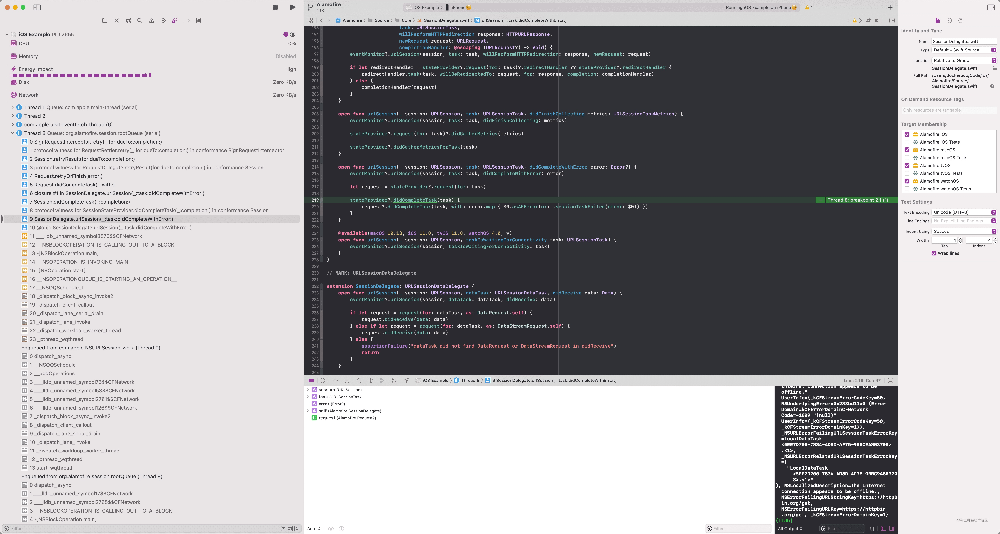

[上篇]({{ site.url }}/2021/11/15/alamofire-workflow/)，我们梳理了`Alamofire`的工作流程。今天我们继续研究，这次主要梳理`RequestInterceptor`(拦截器)的相关内容。

`RequestInterceptor`是一个协议，它本身没有任何要求，只是遵循了和两个协议：

```swift
public protocol RequestInterceptor: RequestAdapter, RequestRetrier {}
```

也就是说，要想实现一个拦截器，满足`RequestAdapter`和`RequestRetrier`即可。下面分别瞅瞅这俩各有什么要求。

## RequestAdapter

`RequestAdapter`是一个请求适配器。对于一个请求，我们可以通过`Adapter`来决定如何操作该请求。具体定义如下：

```swift
public protocol RequestAdapter {
    /// 通过urlRequest和session两个入参，来决定如何处理该请求。处理完的结果通过completion进行回调。例如：
    /// 1. 我们修改该请求，然后回调 completion(.success(someRequest))。这样框架可以继续处理返回的Request
    /// 2. 判断某些必要条件不成立，决定将该请求失败掉，可以回调 completion(.failure(someError))
    /// 由于回调是通过closure进行的，这里也可以做异步操作
    func adapt(_ urlRequest: URLRequest, for session: Session, completion: @escaping (Result<URLRequest, Error>) -> Void)

    /// 和上一个方法类似，这里我们得到的入参更丰富了，多了requestID (RequestAdapterState是个结构体，包含了session和requestID)
    func adapt(_ urlRequest: URLRequest, using state: RequestAdapterState, completion: @escaping (Result<URLRequest, Error>) -> Void)
}
```

如果我们将一个`http`请求事务划分为两个阶段：`请求发送之前`和`收到响应之后`，那么这里的`RequestAdapter`就作用在第一阶段的。`RequestRetrier`是否作用于第二阶段呢？一起往下看。

## RequestRetrier

```swift
public protocol RequestRetrier {
    /// 在请求出错后，通过该方法决定是否需要重试。我们可以有4种处理方式（来自RetryResult枚举）
    func retry(_ request: Request, for session: Session, dueTo error: Error, completion: @escaping (RetryResult) -> Void)
}
```

可以看到这里确实是作用在收到响应之后，只不过限制了在失败的场景。

这里可能的处理方式有 4 种：

```swift
public enum RetryResult {
    /// 立即重试
    case retry
    /// 在指定时间之后重试
    case retryWithDelay(TimeInterval)
    /// 无需重试
    case doNotRetry
    /// 无需重试并报错
    case doNotRetryWithError(Error)
}
```

我只需将具体的处理方式通过`completion`回调回去即可实现对应的效果。

好了，静态的部分暂时分析这么多，下面瞅瞅`RequestInterceptor`是如何运行的。

## RequestInterceptor 是如何工作的

为了观察`RequestInterceptor`的工作方式，我新建了一个`SignRequestInterceptor`，用来完成对请求的签名，将签名通过请求头传递：

> RequestInterceptor 的单元测试有点复杂，对于理解 RequestInterceptor 是个负担，所有这里使用我们自己写的例子。

```swift
class SignRequestInterceptor: RequestInterceptor {
    // MARK: - RequestAdapter

    func adapt(_ urlRequest: URLRequest, using state: RequestAdapterState, completion: @escaping (Result<URLRequest, Error>) -> Void) {
        let request = sign(request: urlRequest)
        completion(.success(request))
    }
    func adapt(_ urlRequest: URLRequest, for session: Session, completion: @escaping (Result<URLRequest, Error>) -> Void) {
        let request = sign(request: urlRequest)
        completion(.success(request))
    }
    // MARK: - RequestRetrier

    func retry(_ request: Request, for session: Session, dueTo error: Error, completion: @escaping (RetryResult) -> Void) {
        completion(.retry)
    }
    // MARK: -

    /// 模拟签名请求，使用url作为签名内容，便于观察
    private func sign(request: URLRequest) -> URLRequest {
        guard let urlString = request.url?.absoluteString else {
            return request
        }
        var retRequest = request
        retRequest.headers.add(name: "X-SIGN", value: urlString)
        return retRequest
    }
}
```

有了自己的`RequestInterceptor`后，我们有两种方式去使用它：

1. `Session`级别，在生成自己的`Session`时同时并配置`Interceptor`：`let session = Session(interceptor: SignRequestInterceptor())`。这种方式配置的，会作用于该`Session`创建的每一个`Request`上。

2. `Request`级别，在构建请求实例时，传入：`AF.request("https://httpbin.org/post", interceptor: SignRequestInterceptor())`。这种方式配置的只作用于当前`Request`。

### RequestAdapter 工作流程

我们在这里打上断点：

```swift
func sign(request: URLRequest) -> URLRequest { ... }
```

发起请求后可以看到如下调用栈：


这里是我们上篇讲到的最后的请求配置阶段，在该阶段，我们的`Interceptor`得以调用。如何处置就看大家的想象了。

### RequestRetrier 工作流程

同样，我们在下面的方法打上断点：

```swift
func retry(_ request: Request, for session: Session, dueTo error: Error, completion: @escaping (RetryResult) -> Void) { ... }
```

然后将网络断掉，模拟网络错误的情况。对应的调用栈如下：



可追溯到的调用起点是系统的回调方法：
`SessionDelegate.urlSession(_:task:didCompleteWithError:)`。在分析具体实现之前，我们先了解下这里引入的几个新面孔：

1. `SessionDelegate`：实现了众多`URLSessionDelegate`，衔接系统框架和`Alamofire`。它包含了几个重要的属性：

```swift
open class SessionDelegate: NSObject {
    /// 文件管理器，主要负责下载请求的文件操作
    private let fileManager: FileManager
    /// 依赖项，多数的操作都依赖该属性，参考 SessionStateProvider
    weak var stateProvider: SessionStateProvider?
    /// 事件监听器，负责通知各种事件
    var eventMonitor: EventMonitor?
}
```

2. `SessionStateProvider`：为了不直接使用`Session`对象，这里使用`SessionStateProvider`将`Session`和`SessionDelegate`隔离开。

```swift
protocol SessionStateProvider: AnyObject {
    /// https证书校验器
    var serverTrustManager: ServerTrustManager? { get }
    /// 重定向处理器
    var redirectHandler: RedirectHandler? { get }
    /// 缓存处理器
    var cachedResponseHandler: CachedResponseHandler? { get }
    /// task到request的映射
    func request(for task: URLSessionTask) -> Request?
    /// 统计信息的报告
    func didGatherMetricsForTask(_ task: URLSessionTask)
    /// 任务完成报告
    func didCompleteTask(_ task: URLSessionTask, completion: @escaping () -> Void)
    /// task级别的证书映射
    func credential(for task: URLSessionTask, in protectionSpace: URLProtectionSpace) -> URLCredential?
    /// 通知请求取消
    func cancelRequestsForSessionInvalidation(with error: Error?)
}
```

下面是`Session`对于该协议的实现：

```swift
extension Session: SessionStateProvider {
    /// 通过task获取request，直接从requestTaskMap类字典结构中取值
    func request(for task: URLSessionTask) -> Request? {
        dispatchPrecondition(condition: .onQueue(rootQueue))
        return requestTaskMap[task]
    }
    /// 在task完成之后，在判断收集到统计信息后，直接回调completion。否则使用waitingCompletions进行收集
    func didCompleteTask(_ task: URLSessionTask, completion: @escaping () -> Void) {
        dispatchPrecondition(condition: .onQueue(rootQueue))
        // 只有在统计信息已经收集才会返回true
        let didDisassociate = requestTaskMap.disassociateIfNecessaryAfterCompletingTask(task)
        if didDisassociate {
            completion()
        } else {
            waitingCompletions[task] = completion
        }
    }
    /// 收集到统计信息，判断task完成后，调用waitingCompletions记录的回调
    func didGatherMetricsForTask(_ task: URLSessionTask) {
        dispatchPrecondition(condition: .onQueue(rootQueue))
        // 只有在task完成后才会返回true
        let didDisassociate = requestTaskMap.disassociateIfNecessaryAfterGatheringMetricsForTask(task)
        if didDisassociate {
            waitingCompletions[task]?()
            waitingCompletions[task] = nil
        }
    }
    /// 获取Request级别的认证信息
    func credential(for task: URLSessionTask, in protectionSpace: URLProtectionSpace) -> URLCredential? {
        dispatchPrecondition(condition: .onQueue(rootQueue))
        return requestTaskMap[task]?.credential ??
            session.configuration.urlCredentialStorage?.defaultCredential(for: protectionSpace)
    }
    /// Session失效时，将请求都失效掉
    func cancelRequestsForSessionInvalidation(with error: Error?) {
        dispatchPrecondition(condition: .onQueue(rootQueue))
        requestTaskMap.requests.forEach { $0.finish(error: AFError.sessionInvalidated(error: error)) }
    }
}
```

3. `EventMonitor`: 事件监听器。这也是一个协议，遵循该协议的可以成为事件监听器，可监听到`URLSession`一系列代理事件和`Request`生命周期内的各种事件。监听器的所有事件都有默认的实现，在对应的扩展中。同时，`Alamofire`也提供了多个实现：

   - `CompositeEventMonitor`监听器的混合器，可以将多个监听器通过该类合并在一起。
   - `ClosureEventMonitor`闭包监听器，将`EventMonitor`的各个方法通过闭包回调。
   - `NSLoggingEventMonitor`日志监听器，负责输出日志到控制台。
   - `AlamofireNotifications`通知监听器，负责将对应事件以通知的形式发出，这里只实现了部分监听方法。

4. `RequestDelegate`: 和`SessionStateProvider`类似，`Request`通过该协议和`Session`通信

```swift
public protocol RequestDelegate: AnyObject {
    /// 获取Session的配置，用于生成cURL命令
    var sessionConfiguration: URLSessionConfiguration { get }
    /// 是否应该立即发起请求。默认true。在request.responseXXX的时候会根据这个参数觉得是否resume这个request
    var startImmediately: Bool { get }
    /// 执行清理操作。如：下载完成后移除下载文件
    func cleanup(after request: Request)
    /// request出错了，请求对于错误的处理方式
    func retryResult(for request: Request, dueTo error: AFError, completion: @escaping (RetryResult) -> Void)
    /// 对于出错的request，触发重试
    func retryRequest(_ request: Request, withDelay timeDelay: TimeInterval?)
}
```

下面是`Session`对于该协议的实现：

```swift
extension Session: RequestDelegate {
    /// 直接返回session（URLSession）的配置
    public var sessionConfiguration: URLSessionConfiguration {
        session.configuration
    }
    /// 直接返回session（Session）的属性startRequestsImmediately
    public var startImmediately: Bool { startRequestsImmediately }
    /// 清理时，将该Request从活动的请求记录中删除
    public func cleanup(after request: Request) {
        activeRequests.remove(request)
    }

    /// 决定如何处理已经出错的请求
    /// 1. 未能获取到请求重试器：直接回调不再重试
    /// 2. 获取到请求重试器：根据请求重试器的结果处理：
    /// a: 重试器返回了错误：回调包装后的错误（AFError）
    /// b: 其他：直接回调
    public func retryResult(for request: Request, dueTo error: AFError, completion: @escaping (RetryResult) -> Void) {
        guard let retrier = retrier(for: request) else {
            rootQueue.async { completion(.doNotRetry) }
            return
        }
        // 这里会调用我们的重试器
        retrier.retry(request, for: self, dueTo: error) { retryResult in
            self.rootQueue.async {
                guard let retryResultError = retryResult.error else { completion(retryResult); return }

                let retryError = AFError.requestRetryFailed(retryError: retryResultError, originalError: error)
                completion(.doNotRetryWithError(retryError))
            }
        }
    }
    /// 重试一个request。
    public func retryRequest(_ request: Request, withDelay timeDelay: TimeInterval?) {
        rootQueue.async {
            let retry: () -> Void = {
                // 取消的request不再重试
                guard !request.isCancelled else { return }
                // 准备阶段：记录重试次数、重置各种进度
                request.prepareForRetry()
                // 请求的配置阶段
                self.perform(request)
            }
            // 若存在延迟，通过gcd执行；否则直接触发重试
            if let retryDelay = timeDelay {
                self.rootQueue.after(retryDelay) { retry() }
            } else {
                retry()
            }
        }
    }
}
```

接下来的工作就简单了。`RequestRetrier`流程其实就是以上个各种方法的使用：

1. `SessionDelegate.urlSession(_:task:didCompleteWithError:)`接收到系统回调。
2. `sessionDelegate`通过`stateProvider`回调`Session.didCompleteTask(_:completion:)`告知`Session`任务完成了。此时`Session`会根据具体状态决定是否从`requestTaskMap`记录中删除 task。
3. `sessionDelegate`回调`Request.didCompleteTask(_:with:)`。此时`Request`会对响应进行验证，之后进入下一步的重试判断阶段。
4. `Request.retryOrFinish(error:)`若没有错误产生，直接进入完成阶段。否则进入下一步的重试。
5. `Request`会调用`delegate(Session).retryResult(for:dueTo:completion:)`获得是否有重试的结果，若需要重试，会调用`delegate(Session).retryRequest(_:withDelay:)`进行重试。我们实现的`SignRequestInterceptor`也正是在`Session.retryResult(for:dueTo:completion:)`方法中获得被调用的机会。

大致流程就是这些，大家可以先对各个参与者有个大致印象，然后跟着流程细看。总体还是比较清晰的。

### Alamofire 提供的 RequestInterceptor(s)

框架内部也实现了一些常用的拦截器，如下：

1. `open class Adapter: RequestInterceptor { ... }`：提供闭包风格的请求适配器。
2. `open class Retrier: RequestInterceptor { ... }`：提供闭包风格的请求重试器。
3. `open class Interceptor: RequestInterceptor { ... }`：拦截器的混合器，可以将多个拦截器包装起来。
4. `public class AuthenticationInterceptor<AuthenticatorType>: RequestInterceptor where AuthenticatorType: Authenticator { ... }`：提供授权功能。
5. `open class RetryPolicy: RequestInterceptor { ... }`：提供更丰富的重试条件控制，如允许重试的次数，允许重试的请求方法，每次重试过后下次重试的间隔等等等。

`AuthenticationInterceptor`和`RetryPolicy`简直不要太强！💯，下面会有专门的文章来分析它们，关注期待吧。🤣

## 总结

今天我们主要梳理里拦截器的工作流程。可以看到，它就是在一个请求事务的前后，给了我们相应的响应机会，其实内容并不复杂。

另外，对应的代码分析，我放在了[GitHub](https://github.com/niwaguan/Alamofire.git)上(分支：`risk`)，希望对你有所帮助。
