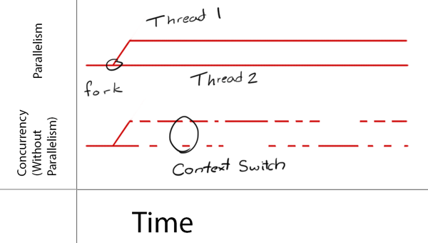
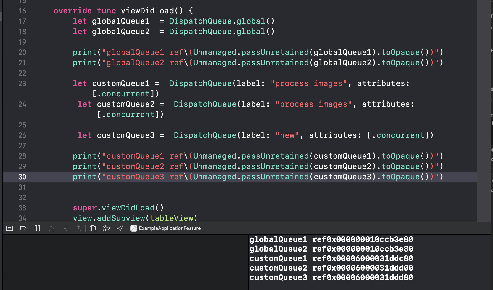
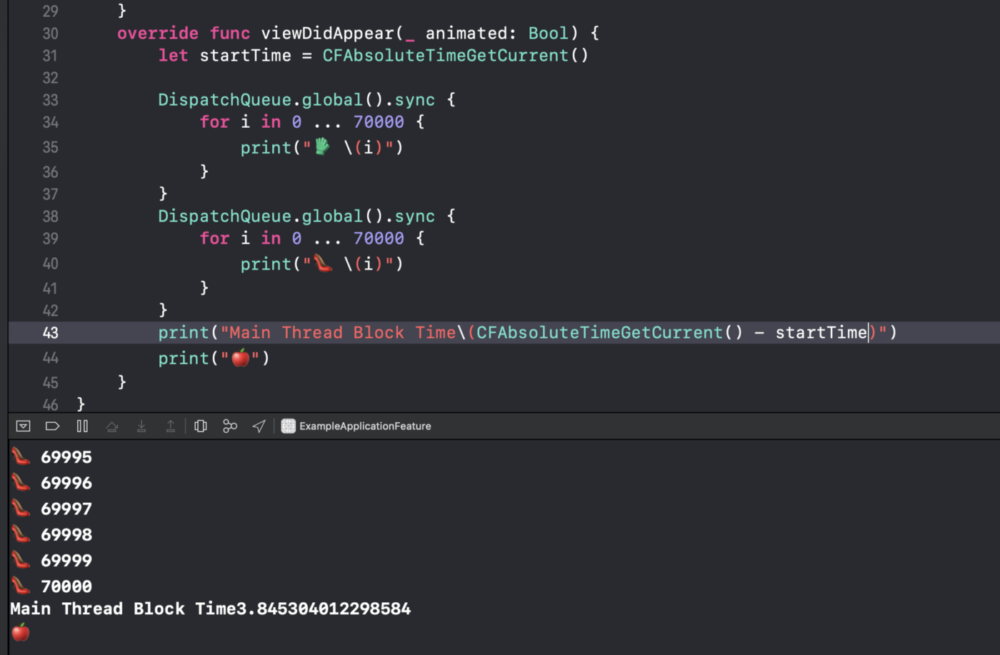
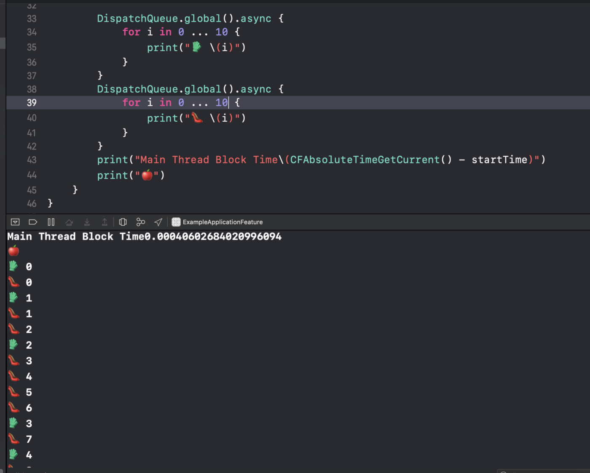
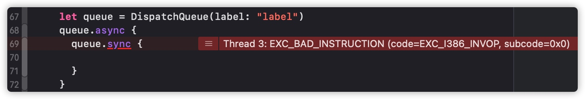
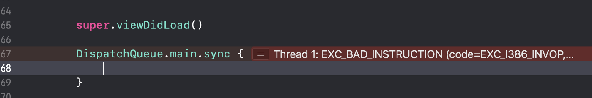

> 原文地址：https://ali-akhtar.medium.com/concurrency-in-swift-grand-central-dispatch-part-1-945ff05e8863



这里是`Swift并发编程系列`第一篇（共四篇）。包含以下内容：
* 为什么需要并发编程
* 并发于并行的区别
* GCD中的队列与函数
* 预防死锁
* `DispatchWorkItem`

## 为什么需要并发

假设您在主线程上并且需要来自服务器的数据。您从服务器请求数据并等待，直到您从服务器获得响应。在此期间，您的主线程不会执行任何与 UI 相关的工作，这会使您的应用程序无响应。假设服务器在此期间需要 10 秒才能给出响应，如果用户点击按钮，系统将不会响应它，这对用户来说非常糟糕。

如果你可以在同一时间（或大约在同一时间）运行的这两个任务，一个线程专门处理用户界面相关的工作，其他的线程处理耗时任务。这样一来，上面的情况就不会发生了。

## 并发

并发意味值应用程序可以使用`分割时间`的方式同时处理多个任务。如果一台计算机只有一个`CPU`，那么它无法在一个`精确的时间点`上同时运行多个任务，但是可以通过`上下文切换`的方式在一段时间（很短，比如1s）内执行多个任务。

`上下文切换`是指存储线程的状态，并在将来恢复这个状态继续执行。这允许多个进程共享一个`CPU`资源，同时这也是多任务操作系统的基本功能。

## 并行

并行指多个任务同时发生，并没有上下文切换。

对于我们讨论的情况，如果并行地执行网络调用，那么将有两个线程在两个不同的内核上执行主线程和后台指令，与前一个相比，速度非常快，但需要额外的物理要求-需要`CPU`有多核。

如下图所示，在并行的情况下，两条线程真的在同时执行；而并发，在一个线程执行时，另一个在休眠。


## 关于线程的小知识

1. 在单核`CPU`上，如果你创建了10条线程，那么它只能使用`并发`/`时间片分割`/`上下文切换`的方式执行它们

2. 在`10核CPU`上，如果你创建了10条线程，那么它们可能以下面的方式执行：
    1. 使用上下文切换的方式在1个核心上`并发`执行
    2. 每个线程在独立的核心上`并行`执行
    3. 一部分`并发`执行，另外一部分`并行`执行

3. 在单核`CPU`上，如果你创建了1000条线程，那么`CPU`只会忙着`上下文切换`，而不会执行实质性的任务。可见，创建合理的线程数量也是一个不小的挑战。

## GCD 如何执行并发/并行

GCD 在幕后管理共享线程池并在该池中添加最佳线程数。使用 GCD，您将代码块或工作项添加到队列中，GCD 决定在哪个线程上执行它们。GCD 根据系统物理条件或当前负载并发或并行执行此任务。

注意：如果你给 GCD 分配两个任务，你不确定它是并发还是并行运行。

从现在开始，我们将使用术语`并发`代表并发/并行。

## 使用GCD，开发者有什么责任

您所要做的就是定义要并发执行的任务并将它们添加到适当的调度队列中。GCD 负责创建所需的线程并安排您的任务在这些线程上运行，这非常酷😃

## 调度队列

调度队列是一种基于 C 的组件，用于执行自定义任务。调度队列总是按照任务添加到队列的顺序出列和启动任务。调度队列是线程安全的，这意味着您可以同时从多个线程访问它们。**注意，队列不是线程！**

如果您想通过 GCD 执行并发任务，请将它们添加到适当的调度队列中。GCD 将基于队列的配置，挑选并执行任务。

### 串行队列

1. 串行调度队列按照添加到队列的顺序一次执行一项任务。假设您将五个任务添加到串行队列， GCD 将从第一个任务开始，在它执行完成之前，第二个任务将不会开始。
2. 串行队列通常用于同步对特定资源的访问。假设您有两个网络调用都需要 10 秒，因此您决定将这两个任务移到某些后台线程上，而且它们都在访问相同的资源，您想要进行一些同步，您可以将这些任务放在串行队列中。
3. 串行队列串行执行任务意味着一次只有一个线程在使用，但不能保证它们在同一线程上执行。
4. 您可以根据需要创建任意数量的串行队列，并且每个队列相对于所有其他队列同时运行。换句话说，如果您创建四个串行队列，则每个队列一次仅执行一项任务，但最多仍可以同时执行四个任务，每个队列一个。
5. 如果您有两个任务访问相同的共享资源，但他们在不同的线程上运行，则任一线程都可以先修改资源，您需要使用锁来确保两个任务不会同时修改该资源。您可以将两个任务添加到串行调度队列，以确保在任何给定时间只有一个任务修改共享资源。这种基于队列的同步比锁更有效，因为在有竞争和无竞争的情况下，锁总是需要一个昂贵的内核陷阱，而调度队列主要在应用程序的进程空间中工作，并且只在绝对必要时调用内核。

### 并发队列

1. 并发队列并发执行一个或多个任务
2. 如果您将四个单独的任务添加到并发队列，这些任务将按照它们添加到队列的顺序启动。GCD 选择第一个任务在一段时间内执行它，然后在不等待第一个任务完成的情况下启动第二个任务，依此类推。这是理想的地方，这不仅可以真正地做到后台执行，而且不关心这些任务是否也与其他任务同时运行
3. 当前正在执行的任务在由调度队列管理的不同线程上运行。
4. 在任何时间点，执行的任务数量是可变的，这取决于系统条件。当您创建具有四个任务的并发队列时，它会创建多少个线程？答案是不确定。 GCD 将使用多少个线程来执行这些任务，这取决于系统条件，它有可能可以使用一条或四条线程。
5. 在 GCD 中，有两种方法可以同时运行任务，创建自定义并发队列或使用全局并发队列。

### 自定义和全局并发队列的区别

如下图所示，我们创建了两个全局并发队列，您可以看到由于全局队列是整个系统共享的并发队列，因此它始终返回相同的队列；而自定义并发队列是私有的，每次创建时都会返回新队列。



有四个不同优先级的全局并发队列，但在设置全局并发队列时，不直接指定优先级。相反，您指定服务质量 (QoS)，其中包括用户交互、用户启动、实用程序和后台，其中用户交互具有最高优先级，而后台具有最低优先级。下面是`QoS`的使用建议。

1. `.userInteractive` 标志任务需要被立即执行以便提供更出色的用户体验。通常用来做`UI`更新，事件处理等低延时的任务。该类型的任务不应过多。
2. `.userInitiated` 标志任务被用户通过UI界面创建，但是可以被异步执行。通常用在用户一个操作后需要等待，结果返回后继续之前的操作。
3. `.default` 默认值。用于一般性异步任务。
4. `.utility` 标志任务需要较长时间，通常会关联一个进度。比如：`I/O`、网络请求等。
5. `.background` 标志任务的执行用户不太会关心。比如：预加载数据。

与全局队列相比，您可以使用自定义队列执行以下任务：

1. 您可以指定一个对您有意义的标签，以便在自定义队列上进行调试
2. 你可以暂停和重启: `queue.suspend() queue.resume()`
3. 提交`栅栏任务`: `queue.async(flags: .barrier) { ... }`

### 主队列

1. 主队列是一个全局可用的串行队列，它在应用程序的主线程上执行任务
2. 该队列与应用程序的运行循环一起工作，以将排队任务和运行循环的其他事件源任务交错执行​​。因为它在应用程序的主线程上运行，所以主队列通常用作应用程序的关键同步点。

## 同步与异步

我们已经学习了如何在队列上串行或并发地执行任务。使用 GCD，您还可以同步或异步的调度队列。

一般来说，同步函数(`sync`)在任务完成后将控制权返回给调用者。而异步函数(`async`)会在函数调用后，立即将将控制权返回给调用者，它不会等等任务完成。



如上图，您在并发全局队列上执行耗时的任务，但主线程仍然很忙，因为您在主线程 `main` 上同步地在分派任务，它会一直等到任务执行完成。



如上图：我们异步的分派任务，它立即返回到主线程，主线程将首先打印，队列上的列任务将并发执行。

## 预防死锁

> 在并发计算中，死锁是一个组的每个成员都在等待另一个成员（包括它自己）采取行动的状态



在上图中，`queue`是一个串行队列，通过`async`派发的任务A，通过`sync`派发了任务B。此时A会等待B完成后继续向下，而B在A没有完成之前是不会开始。这就造成了死锁。



同样，上图的主队列任务A(viewDidLoad方法)使用`sync`派发任务B，也会造成相互等待从而死锁。

## DispatchWorkItem

`DispatchWorkItem`是一项任务的包装器，可以多次使用，也可以取消。

```swift
let queue = DispatchQueue(label: "com.swiftpal.dispatch.workItem")

//  Create a work item
let workItem = DispatchWorkItem() {
    print("Stored Task")
}

// Task 1
queue.async(execute: workItem)

// Task 2
queue.asyncAfter(deadline: DispatchTime.now() + 1, execute: workItem)

// Work Item Cancel
workItem.cancel()

// Task 3
queue.async(execute: workItem)

if item.isCancelled {
    print("Task was cancelled")
}
```

这里我们创建了一个串行队列，又创建了一个`DispatchWorkItem`，它只包含一句代码。

接下来，我们在取消任务之前派发了该任务两次，之后再次派发该任务。但是对于输出，我们只会看到一次`Stored task`。