> 原文地址：https://ali-akhtar.medium.com/concurrency-in-swift-custom-operations-part-4-154b60bff84c

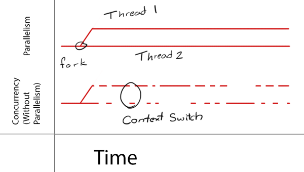

这里是`Swift并发编程系列`第四篇（共四篇 [一]({{ site.url }}/2021/12/30/concurrency-in-swift-1/)、[二]({{ site.url }}/2021/12/30/concurrency-in-swift-2/)、[三]({{ site.url }}/2022/1/12/concurrency-in-swift-3/)、）。主要介绍如何实现自定义的异步`Operation`。

如下图，我们创建了两个`Operation`并将它们都添加到`Operation Queue`中，此外，为了让任务2在任务1完成之后执行，我们让任务2依赖任务1。不出意外的话，它们都会自动在其他线程执行。
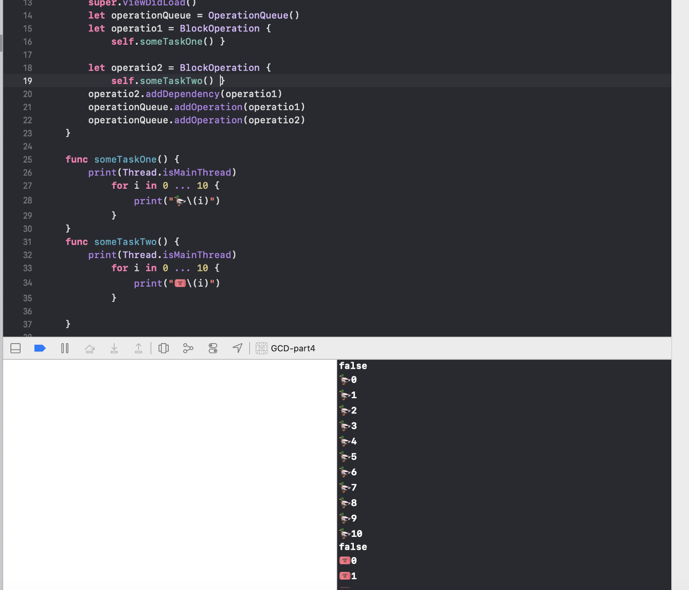

继续看下图，尽管我们添加了依赖规则（任务2依赖任务1），任务2依然没有等到任务1完成后再开始执行。原因是，任务1在向其他线程派发任务后就立即返回了，此时任务2就认为它执行完毕并启动了。在真实的应用中，我们经常会遇到类似问题。那么，如何解决？
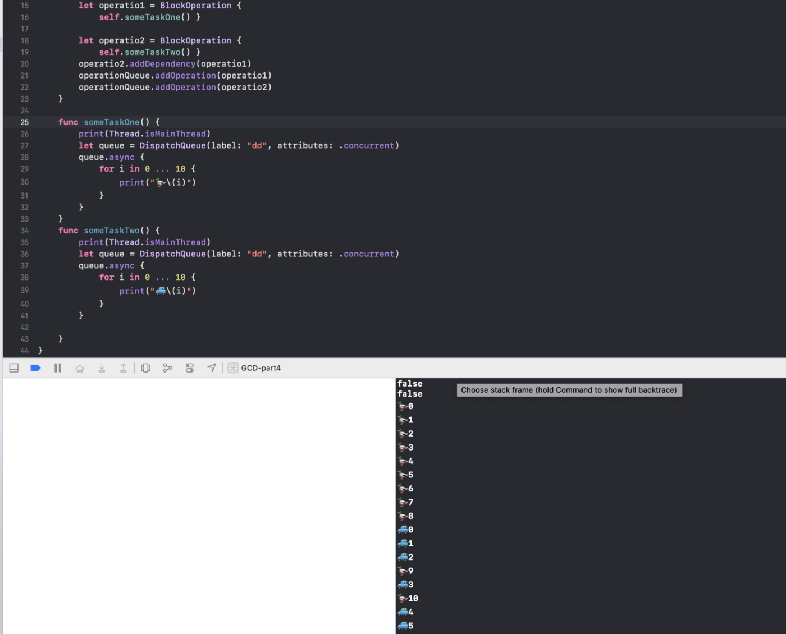

通过手动控制任务执行的状态可以解决上面这个问题。`NSOperation`有默认的逻辑去追踪任务执行的状态。但我们将任务派发到其他线程后，这些逻辑就不正确了，我们必须手动控制任务具体何时结束。

## Operation的状态

相比`Dispatch group`，`Operations`有更复杂的生命周期。这样给与我们更加灵活的控制权。`Operation`对象在其内部管理其生命周期，以便和外部交流，比如什么时候执行任务，什么时候任务完成了。所以，自定义以的子类需要控制其状态确保其任务能正确执行。我们可以通过以下`keypath`来操作状态：

`isReady`：告知客户端该任务已经准备好执行。大多数情况下，你不必手动操作该状态，除非你的任务依赖其他外部条件。此时，在外部条件由不满足转到满足后，你可以手动更改`Operation`的状态至此。

`isExecuting`：告知客户端该任务正在执行中。

`isFinished`：告知客户端任务已经正常结束或被取消并已退出。若存在对该任务的依赖关系，它将在`isFinished`变为`true`时才会清除。同样，串行队列只有在之前任务完成后才会出队下一任务。因此正确处理该值非常重要。

`isCancelled`：告知客户端任务已经请求取消。当然，一个任务是否支持被取消没有做强制要求。

## 正式开始之前

当任务开始时，它的状态从`isReady`到`isExecuting`。如果任务是异步的，比如下载图像，它会将调用发送到网络并立即返回。看起来它已经完成了。它不再在当前线程上做任何工作，但异步任务正在后台线程上运行。您需要一种方法来手动将操作状态设置为`isExecuting` 直到它真正完成。

> 操作状态属性是只读的。你不能直接设置它们。您必须做一些事情来使操作状态属性返回正确的值。操作类依赖KVO（键值观察）发送状态通知。

## 创建异步操作

这里我们要创建一个可重用的异步`Operation`。主要包含一下几点：
1. 首先，创建一个枚举来表示`Operation`的状态。因为`Operation`的状态是只读的，我们无法直接设置其值，所以需要创建一个自己的状态。
2. 我们将默认的状态设置为`ready`。通常情况下，不建议覆写`isReady`，因为系统会自动根据其依赖关系来决定。但是若你的`Operation`需要其他外部条件支持，你可以提供自己的实现。
3. 这里我们只需根据自己定义的状态属性来覆写`isExecuting`和`isFinished`。
4. 覆写`isAsynchronous`属性，这是实现异步`Operation`的必要条件。
5. `Operation`是根据使用`KVO`来跟踪其具体状态的，所以我们需要在状态改变时发出`KVO`通知。这里我们使用`属性监听器`来完成这个工作。具体的，在`willSet()`中我们通知当前状态和下一个状态即将改变，在`didSet()`中我们通知之前的状态和新状态已经改变。
6. 好了，`KVO`已经搞定。
7. 为了方便获取`KVO`的`keypath`我们在状态枚举中实现了计算属性`keypath`
8. 覆写`start()`和`cancel()`方法。在`start()`方法中，检查该任务是否被取消，若取消我们将状态改为`finished`；若没有取消，调用`main()`方法开始任务，并将状态设置为`executing`。而`cancel()`方法直接将状态设置为`finished`.
9. 注意：在`start()`方法中不要调用`super.start()`。根据官方[文档](https://developer.apple.com/documentation/foundation/operation)，在实现异步`Operation`时，必须覆写该方法，去对`Operation`进行初始化。**但是一定不要调用super。**

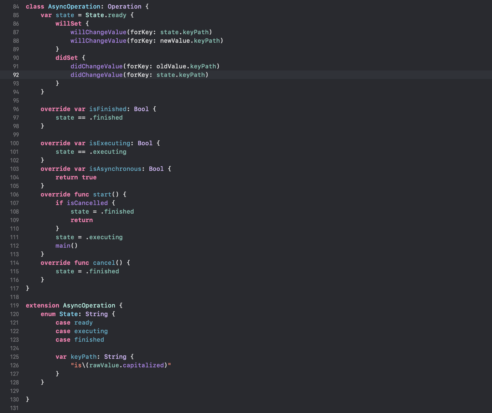

接下来我们实现具体的异步`Operation`只需覆写`main()`方法即可。
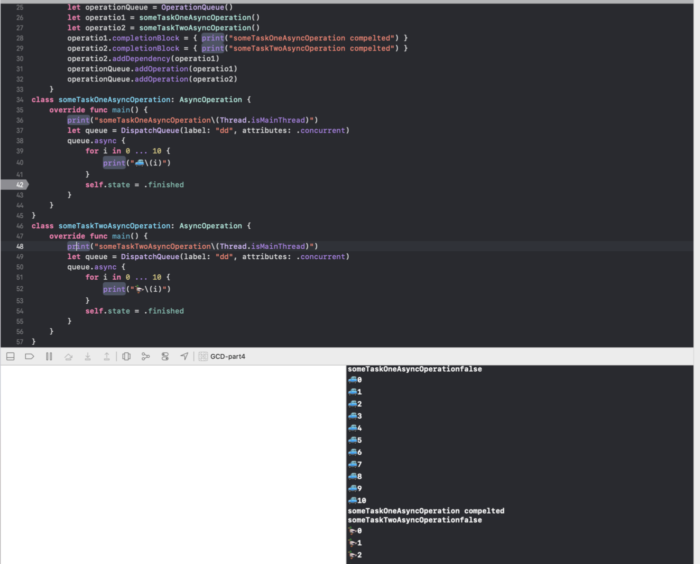

可以看到，`operation2`在`operation1`完成后才继续执行，并且他们都在子线程中执行。`Operation Queue`会自动的重用线程池中的线程。如下图，我们可以看到两个任务在同一线程中执行。
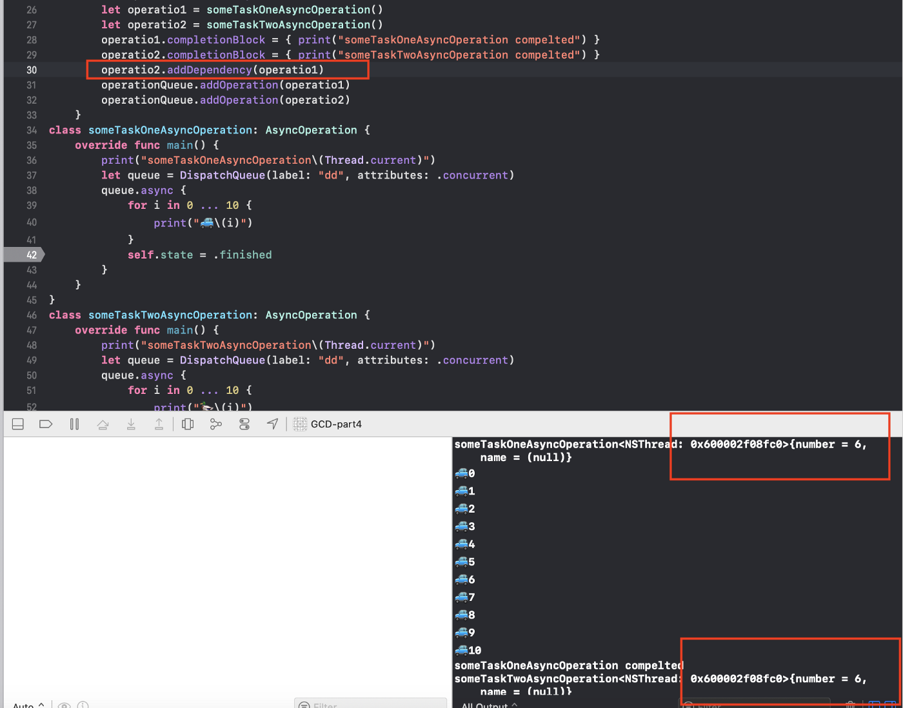

下面我们移除依赖关系，这两个任务会并发的在不同线程执行。
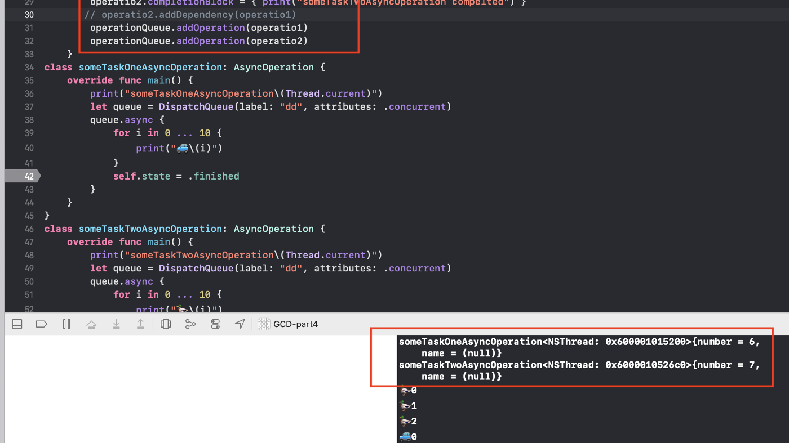

## 线程安全

之前的例子并非是线程安全的。可能存在多个线程同时设置`state`的情况。下面我们在`state`的操作过程中加上`原子性`来保证线程安全。
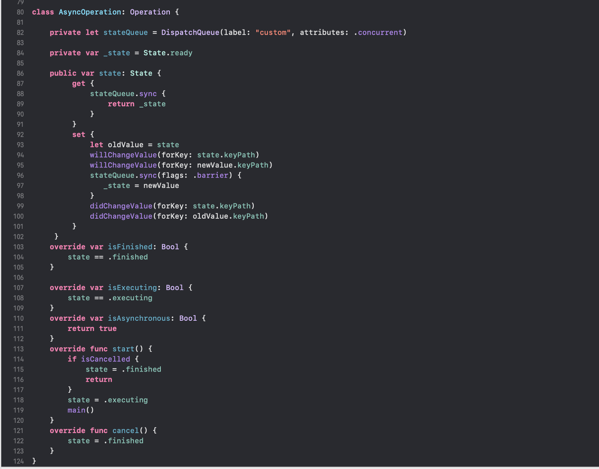

接下来，我们自定义了`Operation Queue`的标识。其背后依赖的`underlyingQueue`也会加上这个标志。

> `underlyingQueue`是`Operation Queue`用来分发任务的`Dispatch Queue`。该属性的默认值为`nil`。你可以手动设置该值，来确保`Operation Queue`使用的分发队列。前提是这个`Operation Queue`中的任务数量为`0`，否则将会抛出`invalidArgumentException`异常。这个值也不能是`主队列`。最后`underlyingQueue`的`qos`会覆盖`Operation Queue`。

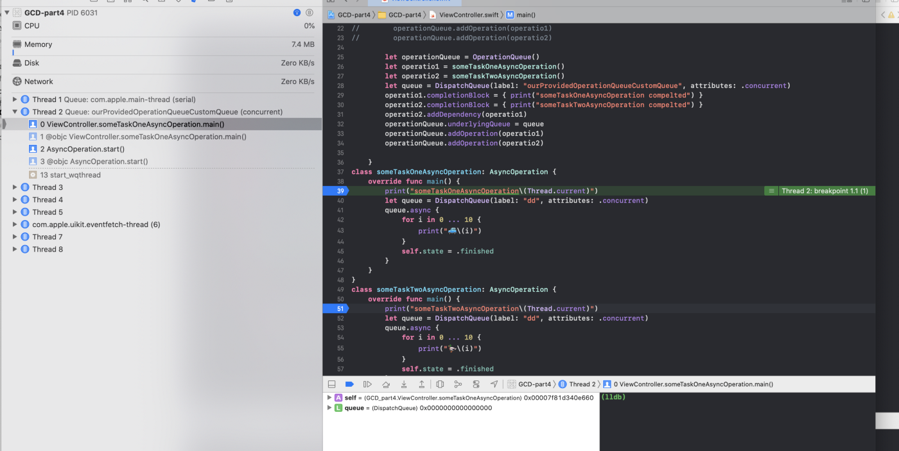
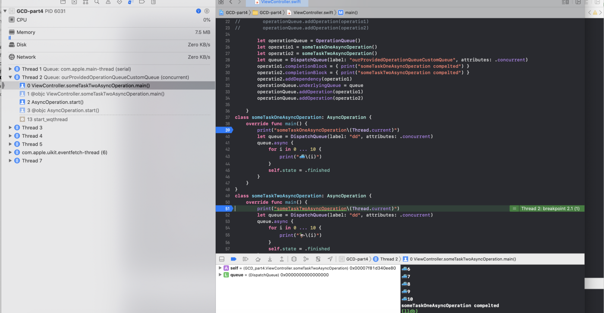

下面我们在`Operation Queue`任务不为`0`的情况下设置了`underlyingQueue`。这将带了奔溃：
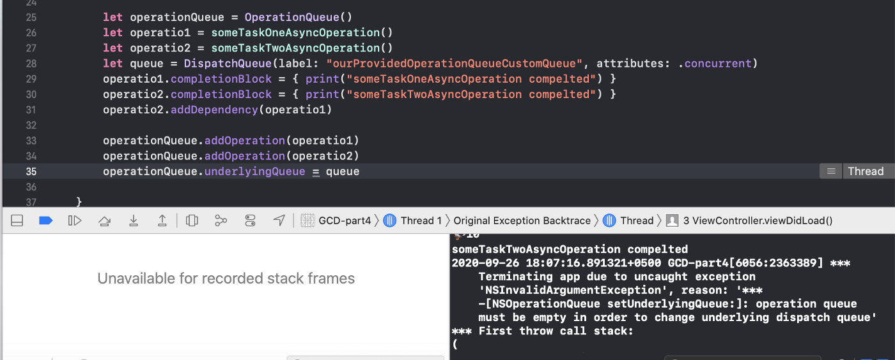

## 总结

连续的4篇主要是熟悉如何在`Swift`中使用异步编程。从`OC`到`Swift`转变的过程中，相关`API`的变化还是比较大的。这里主要了解常用的功能及需要注意的点。希望大家有所收获。