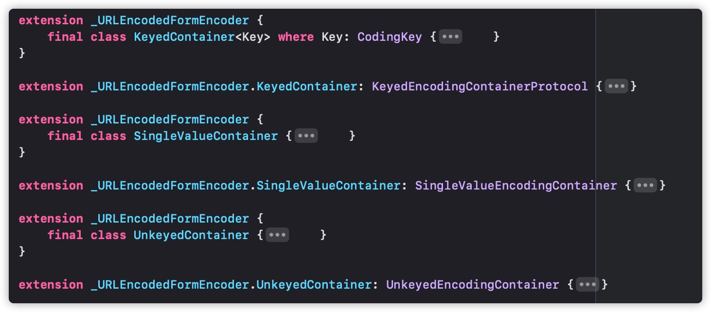
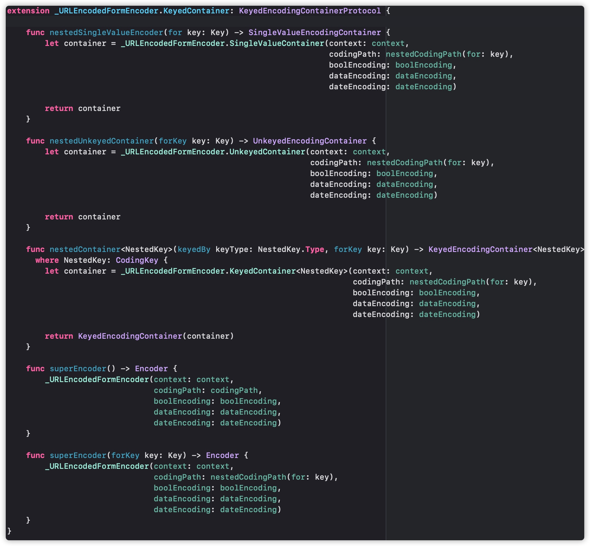
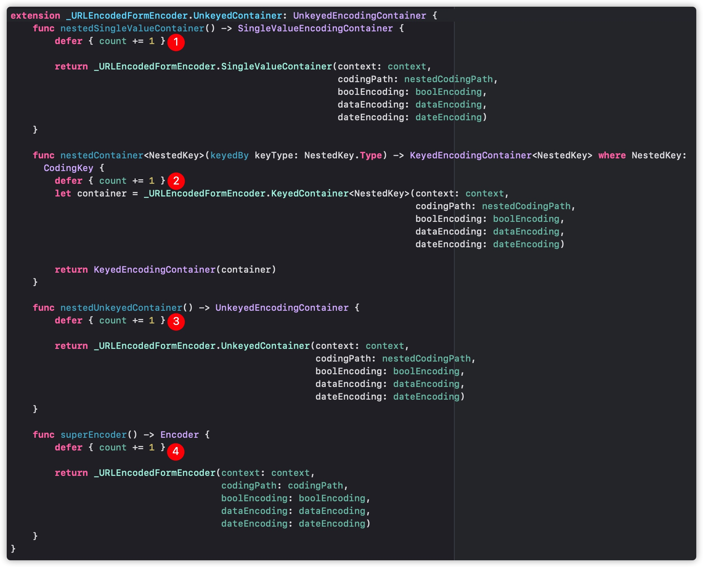

# Alamofire - 理解URLEncodedFormEncoder

`Encodable`表示一种可以被`编码器`进行编码数据结构。比如`JSONEncoder`可以将其编码为`JSON`格式，`PropertyListEncoder`可以将其编码为`.plist`格式，而`Alamofire`中的`URLEncodedFormEncoder`可以将其编码为`application/x-www-form-urlencoded`格式。

将支持`Encodable`的数据进行编码，系统做了很好的抽象，这才有了诸多类型的`编码器`。今天一起来探索下其中的奥秘。

> 下面的内容我将使用`JSONEncoder`和`URLEncodedFormEncoder`作为参考，其他类型的编码器请自行研究。

## 编码器只是起点

不管是`JSONEncoder`还是`URLEncodedFormEncoder`，它们只是整个编码过程的起点。在需要编码时，只需调用各自的`encode`方法。除了提供最基本编码入口之外，它们还提供了丰富的配置项，以便个性化输出。比如`JSONEncoder`，支持如下配置：

```swift
/// 已经简化过的信息
open class JSONEncoder {
    /// 输出格式化
    open var outputFormatting: JSONEncoder.OutputFormatting
    /// 日期类型数据的编码策略
    open var dateEncodingStrategy: JSONEncoder.DateEncodingStrategy
    /// `Data`类型数据的编码策略
    open var dataEncodingStrategy: JSONEncoder.DataEncodingStrategy
    /// 不支持浮点标准的数字处理策略
    open var nonConformingFloatEncodingStrategy: JSONEncoder.NonConformingFloatEncodingStrategy
    /// 编码使用的键处理策略
    open var keyEncodingStrategy: JSONEncoder.KeyEncodingStrategy
    /// 自定义的信息
    open var userInfo: [CodingUserInfoKey : Any]
}
```
再比如`URLEncodedFormEncoder`：

```swift
/// 已经简化过的信息
public final class URLEncodedFormEncoder {
    /// 是否使用字母表顺序排列
    public let alphabetizeKeyValuePairs: Bool
    /// 数组的编码策略
    public let arrayEncoding: ArrayEncoding
    /// bool类型的编码策略
    public let boolEncoding: BoolEncoding
    /// `Data`类型的编码策略
    public let dataEncoding: DataEncoding
    /// 日期类型的编码策略
    public let dateEncoding: DateEncoding
    /// 键的转换策略
    public let keyEncoding: KeyEncoding
    /// 空格的编码策略
    public let spaceEncoding: SpaceEncoding
    /// 允许的字符集
    public var allowedCharacters: CharacterSet
}
```
可以看到后者的配置项明显的多于前者，这也是为了输出不同格式的结果。

## 一线的高光者们

在调用`Encoder`们的`encode`方法后，我们的`Encodable`的`encode(to encoder: Encoder)`方法将被调用。这里是进行具体编码的主要战场。

> 不熟悉手动编码的同学，可以参考[这篇文章]({{ site.url }}/2021/12/15/encoding-and-decoding-in-swift/)。这里包含了大多数使用场景，很适合练手。

### Encoder协议

我们先看下`Encoder`的定义：

```swift
public protocol Encoder {
    /// 编码路径。
    /// 只有在嵌套结构中，才会出现多个CodingKey的情况。如：videos ->[0] -> id
    var codingPath: [CodingKey] { get }
    /// 存储自定义信息
    var userInfo: [CodingUserInfoKey : Any] { get }
    /// 三种容器，下面会介绍
    func container<Key>(keyedBy type: Key.Type) -> KeyedEncodingContainer<Key> where Key : CodingKey
    func unkeyedContainer() -> UnkeyedEncodingContainer
    func singleValueContainer() -> SingleValueEncodingContainer
}
```

通过上面的定义以及我们使用`Encoder`经验，不难看出`Encoder`在实际的编码过程中充当了`管理者`的身份。它主要负责记录当前`encode`的状态，比如当前解析的路径，提供存储值的容器。

作为管理者，当然不能什么事都亲自处理。而`容器`正是其得力助手，可以说`容器`才是实际的搬砖者。

### EncodingContainers

`EncodingContainer`可以理解为数据的存储器，任何满足`Encodable`的数据都可以存在其中，它主要有3种：

1. `KeyedEncodingContainer`：负责`Key-Value`结构。
2. `UnkeyedEncodingContainer`：负责`数组`结构。
3. `SingleValueEncodingContainer`：负责单一值结构，如`Int`、`String`、`AnyEncodable`

一个`EncodingContainer`的内容大致分为几类：
1. 上下文信息
2. 具体类型的编码支持方法
3. 嵌套容器支持方法
4. `superDecoder`

下面以`KeyedEncodingContainer`为例说明其中包含的主要组成部分：

```swift
/// KeyedEncodingContainer是KeyedEncodingContainerProtocol的实现
public struct KeyedEncodingContainer<K> : KeyedEncodingContainerProtocol where K : CodingKey {
    /// 关联的键类型
    public typealias Key = K

    /// 上下文信息
    public var codingPath: [CodingKey] { get }
    /// nil值支持
    public mutating func encodeNil(forKey key: KeyedEncodingContainer<K>.Key) throws
    /// Bool类型
    public mutating func encode(_ value: Bool, forKey key: KeyedEncodingContainer<K>.Key) throws
    /// String类型
    public mutating func encode(_ value: String, forKey key: KeyedEncodingContainer<K>.Key) throws
    /// 浮点类型
    public mutating func encode(_ value: Double, forKey key: KeyedEncodingContainer<K>.Key) throws
    public mutating func encode(_ value: Float, forKey key: KeyedEncodingContainer<K>.Key) throws
    /// 整形
    public mutating func encode(_ value: Int, forKey key: KeyedEncodingContainer<K>.Key) throws
    public mutating func encode(_ value: Int8, forKey key: KeyedEncodingContainer<K>.Key) throws
    public mutating func encode(_ value: Int16, forKey key: KeyedEncodingContainer<K>.Key) throws
    public mutating func encode(_ value: Int32, forKey key: KeyedEncodingContainer<K>.Key) throws
    public mutating func encode(_ value: Int64, forKey key: KeyedEncodingContainer<K>.Key) throws
    /// 无符号整形
    public mutating func encode(_ value: UInt, forKey key: KeyedEncodingContainer<K>.Key) throws
    public mutating func encode(_ value: UInt8, forKey key: KeyedEncodingContainer<K>.Key) throws
    public mutating func encode(_ value: UInt16, forKey key: KeyedEncodingContainer<K>.Key) throws
    public mutating func encode(_ value: UInt32, forKey key: KeyedEncodingContainer<K>.Key) throws
    public mutating func encode(_ value: UInt64, forKey key: KeyedEncodingContainer<K>.Key) throws
    /// 泛型支持
    public mutating func encode<T>(_ value: T, forKey key: KeyedEncodingContainer<K>.Key) throws where T : Encodable
    /// 以上类型的可选类型
    public mutating func encodeIfPresent<T>(_ value: T?, forKey key: KeyedEncodingContainer<K>.Key) throws where T : Encodable
    /// 嵌套容器支持
    public mutating func nestedContainer<NestedKey>(keyedBy keyType: NestedKey.Type, forKey key: KeyedEncodingContainer<K>.Key) -> KeyedEncodingContainer<NestedKey> where NestedKey : CodingKey
    public mutating func nestedUnkeyedContainer(forKey key: KeyedEncodingContainer<K>.Key) -> UnkeyedEncodingContainer
    /// 继承情况支持
    public mutating func superEncoder(forKey key: KeyedEncodingContainer<K>.Key) -> Encoder
}
```

其他类型的容器也大同小异，都是在为各种数据类型和各种编码情况作支持。

## 自定义编码器

`URLEncodedFormEncoder`及相关类实现了自定义的编码器，接下来我们一起来研究下具体细节。

和`JSONEncoder`一样，`URLEncodedFormEncoder`并不遵循`Encoder`协议。它们只提供配置及接口，不是实际的工作者。

而`_URLEncodedFormEncoder`实现了`Encoder`。它提供了一个`Encoder`所必须的必要条件：

```swift
final class _URLEncodedFormEncoder {
    /// 记录编码路径
    var codingPath: [CodingKey]
    /// 该 编码器不支持自定义的信息存储，只是返回了空数据
    var userInfo: [CodingUserInfoKey: Any] { [:] }
    /// 编码结果的中间存储
    let context: URLEncodedFormContext
    /// 从URLEncodedFormEncoder获得的编码选项
    private let boolEncoding: URLEncodedFormEncoder.BoolEncoding
    private let dataEncoding: URLEncodedFormEncoder.DataEncoding
    private let dateEncoding: URLEncodedFormEncoder.DateEncoding
}
/// 通过扩展遵循了`Encoder`，提供三种容器
extension _URLEncodedFormEncoder: Encoder {}
```

### 三种容器

这里提供的三种容器，均定义在`_URLEncodedFormEncoder`扩展中，然后以扩展的形式遵循对应的容器协议：


每种容器都有一些统一的配置：

```swift
/// 解析路径
var codingPath: [CodingKey]
/// 解析上下文，随着解析过程的递进，其内容也会动态变化
private let context: URLEncodedFormContext
/// 下面是一些特定类型解析策略的配置
private let boolEncoding: URLEncodedFormEncoder.BoolEncoding
private let dataEncoding: URLEncodedFormEncoder.DataEncoding
private let dateEncoding: URLEncodedFormEncoder.DateEncoding
```

由于每种容器由于处理的结构不一样，它们各自还有一些特有功能支持。

#### KeyedContainer

`KeyedContainer`处理的是`Key-Value`结构，这种结构支持嵌套，所以在`解析路径`上面也需要支持：

```swift
/// 使用现在的路径加上嵌套键名作为新的路径
private func nestedCodingPath(for key: CodingKey) -> [CodingKey] {
    codingPath + [key]
}
```
在其他实现上，`KeyedContainer`实现了一个泛型编码方法：

```swift
func encode<T>(_ value: T, forKey key: Key) throws where T: Encodable {
    var container = nestedSingleValueEncoder(for: key)
    try container.encode(value)
}
```

对于`Key-Value`来说，任意`Key`对应`Encodable`类型的`Value`都是单一的值。所以这里直接将进一步的解析交给`SingleValueContainer`。

其他关于各种容器的切换就是返回对应的类型，这里就不再细说。



#### UnkeyedContainer

和`KeyedContainer`一样，`UnkeyedContainer`也是支持嵌套的，但是在`解析路径`的实现细节上有所不同：它没有键名，所以使用了索引来生成嵌套的路径。

```swift
var nestedCodingPath: [CodingKey] {
    codingPath + [AnyCodingKey(intValue: count)!]
}
```

> `AnyCodingKey`是为了支持`索引`到`CodingKey`的转变而添加的类型。

在其他实现上，对于各种类型的编码支持也落脚到一个泛型方法：

```swift
func encode<T>(_ value: T) throws where T: Encodable {
    var container = nestedSingleValueContainer()
    try container.encode(value)
}
```
`UnkeyedContainer`也是支持嵌套的，所以也可以按照`KeyedContainer`的逻辑来实现。

需要注意的是：数组结构是按照索引，从前到后依次解析的，所以在每解析一个元素后，索引就会向后移动一个。这也就引申出`UnkeyedContainer`的另外一个配置`count`，它记录着当前解析元素的位置。所以，这里的每一次容器转换，都会对`count`进行`+1`。



#### SingleValueContainer

前面说过`SingleValueContainer`代表了一个`Encodable`的单值结构。所以它只能被编码一次。这里通过`canEncodeNewValue`来记录是否可以编码，并提供一个检查方法，在异常时抛出错误：

```swift
private func checkCanEncode(value: Any?) throws {
    guard canEncodeNewValue else {
        let context = EncodingError.Context(codingPath: codingPath,
                                            debugDescription: "Attempt to encode value through single value container when previously value already encoded.")
        throw EncodingError.invalidValue(value as Any, context)
    }
}
```

由于`SingleValueContainer`是编码结构中的叶节点，它提供了全套的基本类型编码方法支持，以及`nil`和`Encodable`。基本类型的编码，都会落脚到这里（记为worker，后面还会用到）：

```swift
private func encode<T>(_ value: T, as string: String) throws where T: Encodable {
    try checkCanEncode(value: value)
    defer { canEncodeNewValue = false }

    context.component.set(to: .string(string), at: codingPath)
}
```
在这里改变了上下文中的内容，将编码后的值存储在其中。而对于`Encodable`类型的支持，会先判断是否为`Date`/`Data`/`Decimal`，若满足条件，会通过指定的转换策略转换为`String`，最后送入`worker`：

```swift
func encode<T>(_ value: T) throws where T: Encodable {
    switch value {
    case let date as Date:
        guard let string = try dateEncoding.encode(date) else {
            try attemptToEncode(value)
            return
        }
        try encode(value, as: string)
    case let data as Data:
        guard let string = try dataEncoding.encode(data) else {
            try attemptToEncode(value)
            return
        }
        try encode(value, as: string)
    case let decimal as Decimal:
        // Decimal's `Encodable` implementation returns an object, not a single value, so override it.
        try encode(value, as: String(describing: decimal))
    default:
        try attemptToEncode(value)
    }
}
```

在其他类型上，会通过`attemptToEncode`方法再次进入`_URLEncodedFormEncoder`的工作流程中。

而`EncodingError.Context`是整个过程中的记录者，存储着`Encodable`的另一种表现形式。完成从`Encodable`到`EncodingError.Context`的转换后，`Encoder`的工作就可以告一段落了。下面一起来瞅瞅这个`Context`。

### 接力棒Context

`URLEncodedFormContext`的设计非常简单。只有一个`component`成员：

```swift
final class URLEncodedFormContext {
    var component: URLEncodedFormComponent

    init(_ component: URLEncodedFormComponent) {
        self.component = component
    }
}
```

而`URLEncodedFormComponent`是真正的具体值。它是一个枚举，各种`case`正代表了一个`Encodable`的各种情况：

```swift
enum URLEncodedFormComponent {
    typealias Object = [(key: String, value: URLEncodedFormComponent)]
    /// 单值
    case string(String)
    /// 数组，元素为URLEncodedFormComponent
    case array([URLEncodedFormComponent])
    /// 对象，使用数组存储各个`Key-Value`
    case object(Object)
    ...
}
```

假如有如下`Encodable`：

```swift
struct Element: Encodable {
    let a = "a"
    let b = [1]
}
[
    Element(),
    Element()
]
```
那么它对应到`URLEncodedFormComponent`的情况如下：

```swift
.array([
    .object([
        ("a": .string("a")), 
        ("b": .array([.string("1")]))
    ]),
    .object([
        ("a": .string("a")), 
        ("b": .array([.string("1")]))
    ]),
])
```

`component`在整个解析过程中是动态变化的，这主要通过下面的方法：

```swift
private func set(_ context: inout URLEncodedFormComponent, to value: URLEncodedFormComponent, at path: [CodingKey]) {
    // 根对象
    guard !path.isEmpty else {
        context = value
        return
    }
    // 每次从path中取出第一个，作为当前的路径(记为end)
    // 处理对应的值(记为child)
    let end = path[0]
    var child: URLEncodedFormComponent
    // 下面是处理值的过程
    switch path.count {
    // 若路径只有一级，value就是当前需要处理的值
    case 1:
        child = value
    // 若路径大于一级，需要递归处理每一级。等递归返回时，
    // child的值也就处理完成了。
    // 如上面示例的数组第一个元素的a成员，0->a
    case 2...:
        // 数组结构。因为键是以数字生成的
        if let index = end.intValue {
            // 尝试获取数组结构
            let array = context.array ?? []
            if array.count > index {
                child = array[index]
            } else {
                child = .array([])
            }
            set(&child, to: value, at: Array(path[1...]))
        }
        // 对象结构
        else {
            child = context.object?.first { $0.key == end.stringValue }?.value ?? .object(.init())
            set(&child, to: value, at: Array(path[1...]))
        }
    default: fatalError("Unreachable")
    }
    // 在值处理完成后，需要确定当前上下文的结构，
    // 并根据结构来存储上面处理过的值。
    
    // 数组结构。
    if let index = end.intValue {
        if var array = context.array {
            if array.count > index {
                array[index] = child
            } else {
                array.append(child)
            }
            context = .array(array)
        } else {
            context = .array([child])
        }
    }
    // 对象结构
    else {
        // 找到了对象结构
        if var object = context.object {
            // 在对象结构中差值指定的键end
            if let index = object.firstIndex(where: { $0.key == end.stringValue }) {
                object[index] = (key: end.stringValue, value: child)
            } else {
                object.append((key: end.stringValue, value: child))
            }
            // 记录最新结果
            context = .object(object)
        }
        // 没找到就初始化新的
        else {
            context = .object([(key: end.stringValue, value: child)])
        }
    }
}
```

### 最后的站点

要得到`application/x-www-form-urlencoded`格式的字符串，我们还差最后一步-序列化！这一步是由`URLEncodedFormSerializer`负责。

`URLEncodedFormSerializer`主要有两部分组成：配置和支持方法。

在前面讲到`URLEncodedFormEncoder`的配置时，一共列出了`8`个。其中`3`（`Date`、`Date`、`bool`类型的解析策略）个在容器里使用了；剩下的`5`个会在这里登场：

```swift
final class URLEncodedFormSerializer {
    private let alphabetizeKeyValuePairs: Bool
    private let arrayEncoding: URLEncodedFormEncoder.ArrayEncoding
    private let keyEncoding: URLEncodedFormEncoder.KeyEncoding
    private let spaceEncoding: URLEncodedFormEncoder.SpaceEncoding
    private let allowedCharacters: CharacterSet
    ...
}
```

编码支持方法，主要完成`URLEncodedFormComponent`到`String`的任务：

```swift

/// 对URLEncodedFormComponent.Object类型进行序列化
/// 1. 遍历每一个key-value对其进行序列化
/// 2. 按需排序
/// 3. 拼接输出
func serialize(_ object: URLEncodedFormComponent.Object) -> String {
    var output: [String] = []
    for (key, component) in object {
        let value = serialize(component, forKey: key)
        output.append(value)
    }
    output = alphabetizeKeyValuePairs ? output.sorted() : output

    return output.joinedWithAmpersands()
}
/// 对URLEncodedFormComponent类型进行序列化
/// 根据URLEncodedFormComponent具体值的类型，分别进行序列化
func serialize(_ component: URLEncodedFormComponent, forKey key: String) -> String {
    switch component {
    case let .string(string): return "\(escape(keyEncoding.encode(key)))=\(escape(string))"
    case let .array(array): return serialize(array, forKey: key)
    case let .object(object): return serialize(object, forKey: key)
    }
}
/// 使用key对URLEncodedFormComponent.Object类型进行序列化
/// {a: {x: 1, y: 2}} => a[x]=1&a[y]=2
func serialize(_ object: URLEncodedFormComponent.Object, forKey key: String) -> String {
    var segments: [String] = object.map { subKey, value in
        let keyPath = "[\(subKey)]"
        return serialize(value, forKey: key + keyPath)
    }
    segments = alphabetizeKeyValuePairs ? segments.sorted() : segments

    return segments.joinedWithAmpersands()
}
/// 使用key对[URLEncodedFormComponent]进行序列化
/// a: [1, 2] => a[]=1&a[]=2 || a=1&a=2
/// 上面的两种格式是由arrayEncoding确定
func serialize(_ array: [URLEncodedFormComponent], forKey key: String) -> String {
    var segments: [String] = array.map { component in
        let keyPath = arrayEncoding.encode(key)
        return serialize(component, forKey: keyPath)
    }
    segments = alphabetizeKeyValuePairs ? segments.sorted() : segments

    return segments.joinedWithAmpersands()
}
/// 从字符串中剔除不允许的字符，主要去除URL中不能包含的字符
func escape(_ query: String) -> String {
    var allowedCharactersWithSpace = allowedCharacters
    allowedCharactersWithSpace.insert(charactersIn: " ")
    let escapedQuery = query.addingPercentEncoding(withAllowedCharacters: allowedCharactersWithSpace) ?? query
    let spaceEncodedQuery = spaceEncoding.encode(escapedQuery)

    return spaceEncodedQuery
}
```

## 总结

今天我们主要了解了`Encodable`相关组成，并以`URLEncodedFormEncoder`为例子分析了如何实现一个自定义的`Encodable`。它主要有两大步骤：
1. 实现`Encoder`协议，提供3中容器支持，完成从`Encodable`到`URLEncodedFormComponent`的转换
2. 使用序列化器将`URLEncodedFormComponent`转换为字符串

希望对大家有所帮助，再会！