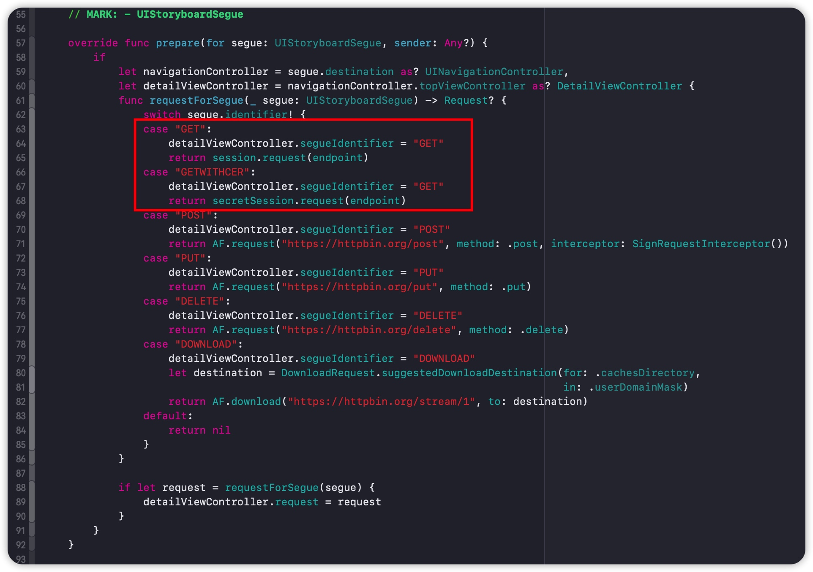
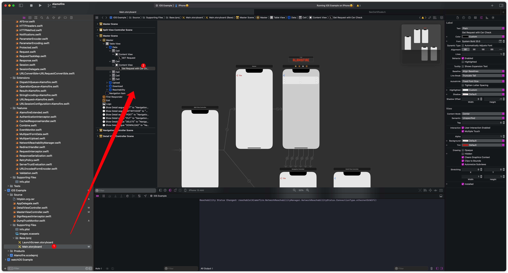
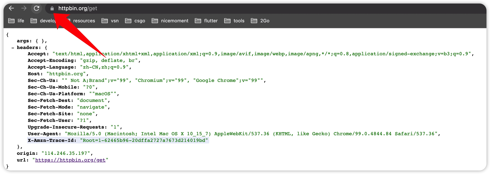
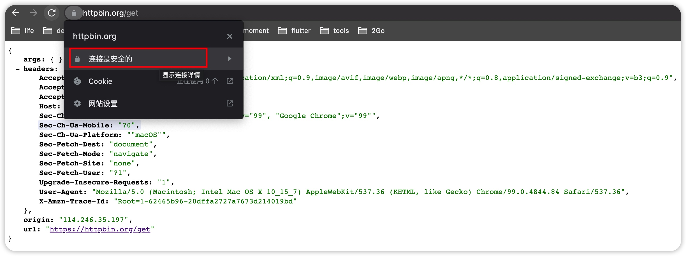
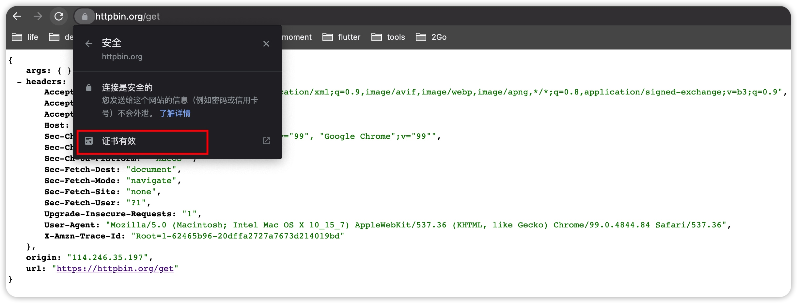
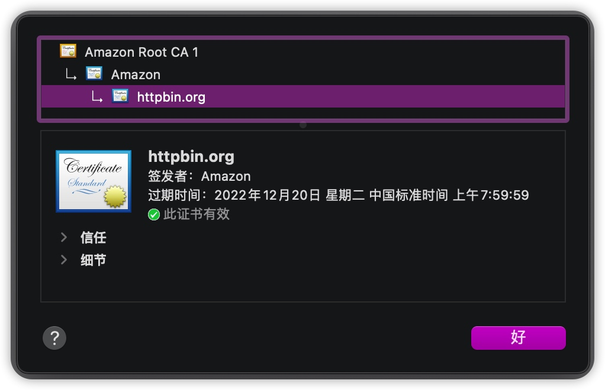
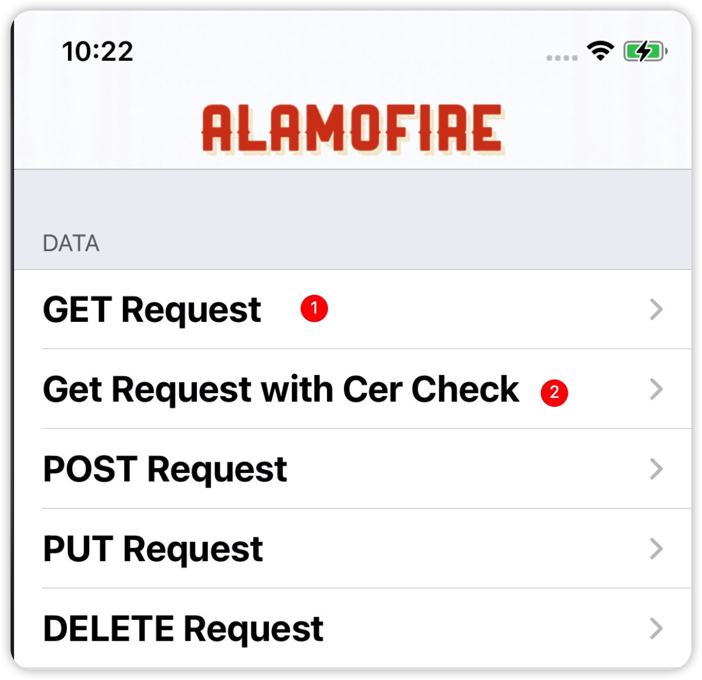

# Alamofire - 如何防止应用接口被抓包？

`Charles`是一款出色的`HTTP`抓包工具，相信大家都有过相关使用经验。（没有的话，它值得你去试一试。）它的基本原理是使用`中间人攻击`。该篇并不会深入讨论其原理，而是以防守方的角色看看如何使用`Alamofire`避免被抓包。

> 没有绝对的安全，这里只是提供一个防守策略。

## 准备工作

为了后续的测试，我们先准备一些代码（`Alamofire`中的事件观察者），将每次`HTTPS`握手的证书信息打印出来。如下：

```swift
class DumpTrustMoniter: EventMonitor {
    func urlSession(_ session: URLSession, task: URLSessionTask, didReceive challenge: URLAuthenticationChallenge) {
        _dumpTrustInfo(challenge.protectionSpace.serverTrust)
    }
    
    func _dumpTrustInfo(_ trust: SecTrust?) {
        guard let trust = trust else {
            print("nothing to dump")
            return
        }
        print("start dump")
        let cerCount = SecTrustGetCertificateCount(trust)
        for i in 0..<cerCount {
            guard
                let cer = SecTrustGetCertificateAtIndex(trust, i),
                let summary = SecCertificateCopySubjectSummary(cer) else {
                continue
            }
            print(summary)
        }
        print("----end---")
    }
}
```

下面我们将这个观察者添加到`Session`中：

```swift
private let session = Session(eventMonitors: [DumpTrustMoniter()])
private let secretSession = Session(serverTrustManager: ServerTrustManager(allHostsMustBeEvaluated: true, evaluators: ["httpbin.org" : PinnedCertificatesTrustEvaluator(certificates: Bundle.main.af.certificates, acceptSelfSignedCertificates: false, performDefaultValidation: true, validateHost: true)]), eventMonitors: [DumpTrustMoniter()]);
```

这里准备了2个`Session`一个普通没有加入证书校验的，另一个加上了，方便做对照。

然后在`MasterViewController`中使用：




⚠️ 这里的sb为啥都不显示，不知为啥。有知道的烦请留言告知下，谢谢！

最后，我们还缺少一个`证书`。打开`https://httpbin.org/get`，按照下面的步骤可以获取：





准备完毕。如果感觉到麻烦，可以在[这里](https://github.com/niwaguan/Alamofire/tree/risk)获取完整代码。

## 启动实验

配置好`Charles`，启动`APP`，先点击第一个：


控制台会将证书链打印出来：

```plain
start dump
httpbin.org
Charles Proxy CA (30 Mar 2020, bogon)
----end---
```

可以看到这里的证书链被修改了，正确的应该是：

```plain
start dump
httpbin.org
Amazon
Amazon Root CA 1
----end---
```

虽然这个证书链被修改了，但是请求依然能成功。接着，我们点击第二个，这次请求不会成功，因为我们加入了证书校验。

## 知其然，知其所以然

可以看到，我们只需一张证书加上一个简单的配置，就可以避免`被抓包`。那么如此强大的功能到底是如何实现的呢？一起来瞅瞅。

### ServerTrustEvaluating

`ServerTrustEvaluating`是一个协议，代表评审团的角色，可以对一次握手进行评估。想成为评审团也很容易，只需遵循该协议。

`PinnedCertificatesTrustEvaluator`就是`Alamofire`提供的一个使用固定证书作为评审标准的实现。除此之外，还有：

* DefaultTrustEvaluator 执行默认的评审标准
* RevocationTrustEvaluator 在默认标准之上加入了`是否吊销`校验。
* PublicKeysTrustEvaluator 在默认的标准之上加入了`公钥`校验。
* DisabledTrustEvaluator 不执行任何校验，不要在生产环境使用。
* CompositeTrustEvaluator 复合校验，混合使用上面的一个或多个。

接下来我们分析下具体实现过程。

> `Alamofire`中大量使用了类似 `type.af.feature` 格式的写法，这种技巧在之前的文章中有提到，感到陌生的同学请移步[这里]({{ site.url }}/2021/09/26/namespace-swift/)。

### DefaultTrustEvaluator

`DefaultTrustEvaluator`的实现不是很繁琐，只有短短的几行代码：

```swift
public final class DefaultTrustEvaluator: ServerTrustEvaluating {
    private let validateHost: Bool
    public init(validateHost: Bool = true) {
        self.validateHost = validateHost
    }

    public func evaluate(_ trust: SecTrust, forHost host: String) throws {
        if validateHost {
            try trust.af.performValidation(forHost: host)
        }

        try trust.af.performDefaultValidation(forHost: host)
    }
}
```

其评估过程具体包含了2步：

1. 按需执行`performValidation`校验`host`，默认是校验的。
2. 执行`performDefaultValidation`进行默认校验。

这里使用到的两个`api`都是`SecTrust`的扩展中的，具体的有：

> 这里使用的数据类型多数来自于系统框架`Security`


1. 对`SecTrust`应用校验策略
```swift
public func apply(policy: SecPolicy) throws -> SecTrust {
    let status = SecTrustSetPolicies(type, policy)

    guard status.af.isSuccess else {
        throw AFError.serverTrustEvaluationFailed(reason: .policyApplicationFailed(trust: type,
                                                                                   policy: policy,
                                                                                   status: status))
    }

    return type
}
```

1. 执行评估：
```swift
public func evaluate() throws {
    var error: CFError?
    let evaluationSucceeded = SecTrustEvaluateWithError(type, &error)

    if !evaluationSucceeded {
        throw AFError.serverTrustEvaluationFailed(reason: .trustEvaluationFailed(error: error))
    }
}
```

1. 应用策略并执行评估，只是对上面两个`api`的组合调用
```swift
public func evaluate(afterApplying policy: SecPolicy) throws {
    try apply(policy: policy).af.evaluate()
}
```

1. 校验`host`以及默认校验
```swift
public func performValidation(forHost host: String) throws {
    if #available(iOS 12, macOS 10.14, tvOS 12, watchOS 5, *) {
        try evaluate(afterApplying: SecPolicy.af.hostname(host))
    } else {
        try validate(policy: SecPolicy.af.hostname(host)) { status, result in
            AFError.serverTrustEvaluationFailed(reason: .hostValidationFailed(output: .init(host, type, status, result)))
        }
    }
}
```
```swift
public func performDefaultValidation(forHost host: String) throws {
    if #available(iOS 12, macOS 10.14, tvOS 12, watchOS 5, *) {
        try evaluate(afterApplying: SecPolicy.af.default)
    } else {
        try validate(policy: SecPolicy.af.default) { status, result in
            AFError.serverTrustEvaluationFailed(reason: .defaultEvaluationFailed(output: .init(host, type, status, result)))
        }
    }
}
```
这两种校验只是在使用不同的策略对象使用上面提到的`evaluate(afterApplying:)`，其他并无区别。

### RevocationTrustEvaluator

和`DefaultTrustEvaluator`一样，这里使用了`SecPolicy.af.revocation(options: options)`的策略进行校验。值得注意的是，校验证书是否被吊销，也是有多种策略可选的，这里使用`Options`进行配置。

### PinnedCertificatesTrustEvaluator

固定证书评审，使用指定证书数据作为依赖，也支持`自签名证书`。所以它可以配置证书文件以及是否为自签名证书。具体的评审过程如下：

```swift
public func evaluate(_ trust: SecTrust, forHost host: String) throws {
    /// 没有证书文件，直接不通过
    guard !certificates.isEmpty else {
        throw AFError.serverTrustEvaluationFailed(reason: .noCertificatesFound)
    }
    /// 若为自签名文件，需要替换评估过程使用的证书
    if acceptSelfSignedCertificates {
        try trust.af.setAnchorCertificates(certificates)
    }
    /// 默认校验
    if performDefaultValidation {
        try trust.af.performDefaultValidation(forHost: host)
    }
    /// host校验
    if validateHost {
        try trust.af.performValidation(forHost: host)
    }
    /// 使用配置的证书和服务器返回证书做比较，若两者没有交集，则不通过
    let serverCertificatesData = Set(trust.af.certificateData)
    let pinnedCertificatesData = Set(certificates.af.data)
    let pinnedCertificatesInServerData = !serverCertificatesData.isDisjoint(with: pinnedCertificatesData)
    if !pinnedCertificatesInServerData {
        throw AFError.serverTrustEvaluationFailed(reason: .certificatePinningFailed(host: host,
                                                                                    trust: trust,
                                                                                    pinnedCertificates: certificates,
                                                                                    serverCertificates: trust.af.certificates))
    }
}
```

### PublicKeysTrustEvaluator

公钥评审，使用指定公钥进行校验。

```swift
public func evaluate(_ trust: SecTrust, forHost host: String) throws {
    /// 没有公钥，直接不通过
    guard !keys.isEmpty else {
        throw AFError.serverTrustEvaluationFailed(reason: .noPublicKeysFound)
    }
    /// 默认校验
    if performDefaultValidation {
        try trust.af.performDefaultValidation(forHost: host)
    }
    /// host校验
    if validateHost {
        try trust.af.performValidation(forHost: host)
    }
    /// 在服务器返回的公钥中查找指定的公钥，如找到则校验通过
    let pinnedKeysInServerKeys: Bool = {
        for serverPublicKey in trust.af.publicKeys {
            for pinnedPublicKey in keys {
                if serverPublicKey == pinnedPublicKey {
                    return true
                }
            }
        }
        return false
    }()

    if !pinnedKeysInServerKeys {
        throw AFError.serverTrustEvaluationFailed(reason: .publicKeyPinningFailed(host: host,
                                                                                  trust: trust,
                                                                                  pinnedKeys: keys,
                                                                                  serverKeys: trust.af.publicKeys))
    }
}
```


## 总结

该篇我们了解到了在使用`Alamofire`时如何防止应用接口被抓包，并简单了解了其内部原理。这其中依赖接口而不是依赖实现的设计很值得我们学习。该模式使得我们后续添加其他评估逻辑变得很简单。希望大家有所收获，感谢您的阅读。再会！