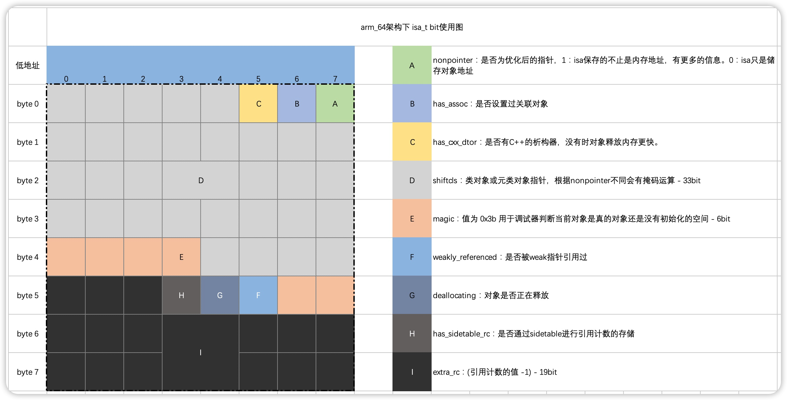

## 在LP64下,一个指针的有多少个字节
32位指针4字节，64位指针8字节。

> LP64指long类型和pointer类型长度都为64字节，[参考](https://en.wikipedia.org/wiki/64-bit_computing#64-bit_data_models)

## 一个实例对象的内存结构存在哪些元素
isa/根类ivars/父类ivars/本类的ivars

`isa`的8字节

## 下面sizeof(struct3) 大小等于

```c
struct LGStruct1 {
    // 1字节
    char b;
    // 填充3字节
    // 4字节
    int c;
    // 8字节
    double a;
    // 2字节
    short d;
    // 填充6字节
} struct1;
sizeof(struct LGStruct1) = 24

struct LGStruct2 {
    // 8
    double a;
    // 4
    int b;
    // 1
    char c;
    // 填充1
    // 2
    short d;
} struct2;
sizeof(struct LGStruct2) = 16

struct LGStruct3 {
    // 8
    double a;
    // 4
    int b;
    // 1
    char c;
    // 填充5
    // 18
    struct LGStruct1 str1;
    // 2
    short d;
    // 填充2
    // 4
    int e;
    // 填充4
    // 16
    struct LGStruct2 str2;
} struct3;
// sizeof(struct LGStruct3) = 64
```

结构体对齐规则：
1. `数据成员`，第一个数据成员放在offset为0的地方，以后每个数据成员的对齐按照#pragma pack指定的数值和这个数据成员自身长度中，比较小的那个进行。
2. 在数据成员完成各自对齐之后，`结构(或联合)本身也要进行对齐`，对齐将按照#pragma pack指定的数值和结构(或联合)最大数据成员（基本类型）长度中，比较小的那个进行。

## 下列代码: re1 re2 re3 re4 re5 re6 re7 re8输出结果

```oc
// 1
BOOL re1 = [(id)[NSObject class] isKindOfClass:[NSObject class]];
// 0
BOOL re2 = [(id)[NSObject class] isMemberOfClass:[NSObject class]];
// 0
BOOL re3 = [(id)[LGPerson class] isKindOfClass:[LGPerson class]];
// 0
BOOL re4 = [(id)[LGPerson class] isMemberOfClass:[LGPerson class]];
NSLog(@" re1 :%hhd\n re2 :%hhd\n re3 :%hhd\n re4 :%hhd\n",re1,re2,re3,re4);
// 1
BOOL re5 = [(id)[NSObject alloc] isKindOfClass:[NSObject class]];
// 1
BOOL re6 = [(id)[NSObject alloc] isMemberOfClass:[NSObject class]];
// 1
BOOL re7 = [(id)[LGPerson alloc] isKindOfClass:[LGPerson class]];
// 1
BOOL re8 = [(id)[LGPerson alloc] isMemberOfClass:[LGPerson class]];
NSLog(@" re5 :%hhd\n re6 :%hhd\n re7 :%hhd\n re8 :%hhd\n",re5,re6,re7,re8);
```

这两个方法都是有实例方法和类方法的。

其中`isKindOfClass`会获取`消息接受者`的`类对象`，跟`入参`进行比较，若不同会使用其父类再次比较，直到根类。

```oc
+ (BOOL)isKindOfClass:(Class)cls {
    for (Class tcls = object_getClass((id)self); tcls; tcls = tcls->superclass) {
        if (tcls == cls) return YES;
    }
    return NO;
}

- (BOOL)isKindOfClass:(Class)cls {
    for (Class tcls = [self class]; tcls; tcls = tcls->superclass) {
        if (tcls == cls) return YES;
    }
    return NO;
}
```

而`isMemberOfClass`更加严格，只会比较`消息接受者`的`类对象`，不会比较继承链。

```oc
+ (BOOL)isMemberOfClass:(Class)cls {
    return object_getClass((id)self) == cls;
}

- (BOOL)isMemberOfClass:(Class)cls {
    return [self class] == cls;
}
```